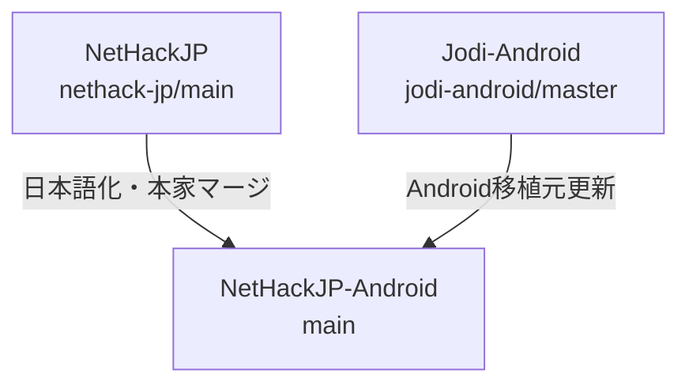

<!-- Modified by NetHackJP contributor @satokiyon; latest change date: 2026-07-21. -->
<!--
  IMPORTANT POLICY FOR NetHackJP-ONLY MODIFICATIONS
  =================================================
  When adding changes to src/ or include/ that are *not* present in
  upstream NetHack (NetHack/NetHack @ NetHack-5.0), follow these rules:

  1. Mark all such custom code regions with a /* NetHackJP: ... */ comment
     in the source file itself, so future readers can quickly identify
     NetHackJP-specific code vs. upstream code.

  2. Add a dedicated subsection below (§4.x) that documents:
     - the marker tag used in the source,
     - which file(s) and roughly which lines contain the custom code,
     - how to "remove" the customization (so we can drop the change
       cleanly if upstream eventually adds an equivalent feature), and
     - how to follow upstream if upstream adds the same or a similar
       change later.

  3. Priority rule: when upstream introduces a change that overlaps with
     a NetHackJP-only customization, the upstream version takes
     precedence — we drop the NetHackJP code and follow upstream.
     Upstream compatibility is the primary goal; NetHackJP-specific
     behavior is secondary.

  This policy is enforced for every commit that touches shared
  upstream files (src/, include/).  Local changes that live entirely
  under sys/ (e.g. win/flutter, sys/android) are exempt because they
  are not part of upstream NetHack.
-->
# NetHackJP 開発メモ
<!-- Modified by NetHackJP contributor @satokiyon; latest change date: 2026-07-11. -->
# NetHackJP-Android 開発メモ

本ドキュメントは、Android ポートの日本語化リポジトリである `NetHackJP-Android` の開発環境の構築、ビルド、マージ運用およびリリース手順についてまとめたものです。

---

## 1. 開発環境の要件（事前準備）

ビルドを実行する前に、Windows環境およびWSL環境に以下のソフトウェアをインストールし、セットアップを完了させてください。

### Windows 環境
- **Android Studio** (または Android SDK Command-Line Tools)
  - Android SDK が必要です。通常は `C:\Users\<ユーザー名>\AppData\Local\Android\Sdk` に配置されます。
- **Java Development Kit (JDK)**
  - Gradle の動作に必要な JDK (Java 17 以上を推奨) をインストールしてください（Android Studio 同梱のものでも構いません）。
- **Git for Windows**
- **PowerShell** (自動ビルドスクリプトの実行に必要)

### WSL 環境 (Windows Subsystem for Linux)
- **Ubuntu** (ビルド自動化スクリプトは `Ubuntu-26.04` ディストリビューションをデフォルトとして動作します)
- WSLのUbuntu上に、Cライブラリコンパイルに必要なパッケージ群をインストールしてください。
  ```bash
  sudo apt update
  sudo apt install build-essential curl
  ```

---

## 2. 開発手順とビルド

### 依存サブモジュールの準備
Android ビルドを行う前に、外部依存サブモジュールをチェックアウト・更新してください。
```bash
git submodule update --init --recursive
```

### 自動ビルドスクリプトの実行
PowerShell から、リポジトリルートにあるビルド自動化スクリプトを実行します。
```powershell
$env:ANDROID_HOME="C:\Users\satok\AppData\Local\Android\Sdk"; .\sys\android\build_android.ps1
```
- **内部処理**:
  1. WSL (Ubuntu-26.04) 上で `sys/android/setup.sh` を実行し、必要な Makefile 群を自動生成・ルートに配置します。
  2. WSL 上で `make fetch-lua` を実行し、依存する Lua 5.4.8 ライブラリを取得します。
  3. C ソースコードをコンパイルし、静的ライブラリ（`nethack.a`）などをビルドします。
  4. Windows 側で Gradle (`gradlew.bat`) を用いて JNI 連携と APK のパッケージング（デバッグビルド）を行います。

### データファイルの変更・追加時
- `/dat/options` や `/dat/rumors_jp` などのテキストファイルを変更または追加した場合は、端末へのアセット上書きコピーを強制するため、必ず `sys/android/app/assets/ver` の中にある数値（整数値）をインクリメント（+1）してください。
- 端末内に古いアセットがキャッシュされていると、変更が反映されません。

---

## 3. 技術上の注意点

### NDK (clang) における全角文字キャストエラー
- **制限**: NDK コンパイラでは、`'。'` などのマルチバイト文字をシングルクォーテーションで囲んで文字定数（`char`）として定義すると `character too large` エラーになります。
- **対策**: 全角文字や記号を条件によって切り替えて出力したい場合は、必ず文字列リテラル（例: `"。"`）を使用し、フォーマット指定子を `%c` から `%s` に変更してください。

### CP437デコーダの無効化（日本語文字化け対策）
- Android版 NetHack は `sys/android/app/res/values/config.xml` の `useCP437Decoder` が `true` の場合、テキスト出力を CP437 としてデコードします。日本語テキストは UTF-8 でエンコードされているため、CP437 デコードでは文字化けが発生します。
- **対策**: `useCP437Decoder` を **`false`** に設定してください。上流リポジトリの同期時にこの設定が巻き戻らないよう注意が必要です。

### FALLTHROUGH マクロの NDK (clang) 互換性
- `include/tradstdc.h` の `FALLTHROUGH` マクロ定義が `__attribute__((fallthrough))` のみだと、特定の文脈（`case` ラベル直後など）で NDK の clang が「expected expression」エラーを出すことがあります。
- **対策**: マクロ定義の先頭にセミコロンを付与し、`; __attribute__((fallthrough))` とします。

### defaults.nh のオプション名エイリアス整合性
- `sys/android/defaults.nh` で日本語版独自のステータス表示オプションを使用する場合、`src/botl.c` 内のフィールド名テーブルに対応するエイリアスが登録されていないと、起動時に警告が出力されます。エイリアスの登録漏れに注意してください。

### Flutter版のヘルプメニュー表示経路
- `?` メニューの項目はすべて同じ経路ではなく、`NetHackについて` や `ゲームオプション一覧` のように `display_file()` へ進むものと、`ゲームオプションの詳細説明` のように `NHW_TEXT` に直接出力されるものが混在しています。
- Flutter ポートでは `win_display_file` を必ず実装し、Java版と同じくヘルプファイルを `NHW_TEXT` に流し込んで表示してください。`display_file()` を未実装にすると、`?` メニューの一部だけが表示されない不具合になります。
- `display_nhwindow()` は Java版と同様に、`WIN_MESSAGE` / `WIN_STATUS` / `WIN_MAP` 以外のウィンドウでは強制的に blocking 扱いにしてください。これを外すと、ヘルプ本文が表示直後に破棄されて見えなくなります。

### Flutter版の PICK_ANY メニュー見出しと選択行
- `PICK_ANY` のメニューには、カテゴリ見出しや区切り行と、実際に選択できるアイテム行が混在します。
- `ident == 0` の行は選択対象ではない見出し・区切りとして扱い、チェックボックスや選択ハイライトの対象にしないでください。
- 見出し行は別スタイルで描画し、食料・魔法書などのカテゴリ名と個別アイテムの違いが見た目で分かるようにしてください。

### Flutter版 DPad の移動モード互換（Java版準拠）
- Flutter の DPad は Java版と同様に、方向キーラベルを固定矢印ではなく可変文字列で描画し、移動モードに応じて `yuhjklbn` / `12346789` / `g+方向` / `G+方向` / `^+方向` / `m+方向` / `F+方向` を切り替えて表示してください。
- 中央ボタンは Java版同様に「短押し: 有効モード循環」「長押し: 使用する移動モード選択ダイアログ表示」を割り当てます。利用可能モードは最低でも `NORMAL,UPPER,G_LOWER,G_UPPER,CTRL,M_CMD,F_CMD` を扱えるようにします。
- 設定キーは Java版と揃えて `dpad_move_mode` と `dpad_enabled_move_modes` を使用し、Flutter 側でも同じフォーマット（カンマ区切りの enum 名）で保存・復元します。これにより Android(Java) と Flutter 間で設定互換を保てます。
- DPad の方向ロング押しは Java版同様に `g<dir>`（走る）を送る挙動を基本とします。

### Flutter版 方向問い合わせ時の入力ルール
- `winflutter.c` の `flutter_yn_function()` は「どの方向 / what direction」を通常のYNダイアログとして送らず、`WIN_MESSAGE` に文面を出して `flutter_nhgetch()` で直接1キー待機します。
- このため Flutter UI 側では、方向問い合わせ中は移動モード設定に関係なく `yuhjklbn` をそのまま送信する必要があります（`G` や `^` などの前置コマンドを送らない）。
- 方向問い合わせ中判定は、少なくとも `WIN_MESSAGE` への `putstr` 文面に `what direction` / `どの方向` が含まれるかで追跡してください。

### Flutter版 複合キー送信（前置コマンド + 方向）時の待機制御
- `g<dir>` / `m<dir>` / `F<dir>` のように2キー連続送信する場合、1キー目送信で入力待機フラグを落とすと2キー目が送れなくなるため、UI 側送信関数に「待機解除しない送信（prefix送信用）」を用意してください。
- 最終キー送信時だけ待機解除する設計にすると、Java版と同様の移動モード入力を安定して再現できます。

### Flutter版キーボードの4レイアウト設計（Java版準拠）
- Flutter版の仮想キーボード（`nethack_keyboard.dart`）は、Java版（`SoftKeyboard.java`）と同様に **QWERTY / Symbols / Meta / Ctrl の4レイアウト**を切り替えて使用します。Meta や Ctrl をトグル修飾子（次の1キーだけを変換する方式）ではなく、**専用レイアウトに切り替える方式**にしてください。
- **Meta キー**: `char | 0x80`（128〜255）のコードを `onRawKeyCode` で直接送信します。例えば `M-a` = 225、`M-2` = 178 です。NetHack のメタコマンド（`M-c` = chat、`M-o` = open、`M-v` = invoke 等）はこの形式で送信されます。
- **Ctrl キー**: `char & 0x1F`（1〜26）の制御コードを `onRawKeyCode` で直接送信します。例えば `^A` = 1、`^D` = 4、`^P` = 16 です。
- **ESC キー**: ASCII 27 を `onRawKeyCode` で送信します。Symbols / Meta / Ctrl レイアウトの下段に配置してください。
- **ゲーム必須キー**: QWERTY 下段に `<` `>` `:` `,` を、Symbols レイアウトに `#` `@` `$` `^` `[` `+` `/` `?` `.` `*` を配置し、NetHack の主要コマンド（階段昇降、look、pick up、拡張コマンド、autopickup、呪文、what-is 等）をキーボードから直接入力できるようにしてください。

### Flutter Colors スウォッチの null 安全性問題
- Flutter の `Colors.grey` などの Material Color スウォッチは、**有効なインデックスが 50, 100, 200, 300, 400, 500, 600, 700, 800, 850, 900 のみ**です。`Colors.grey[950]` のように存在しないインデックスを指定すると `null` を返します。
- この `null` に対して `!`（null check 演算子）を使用すると、実行時に **"Null check operator used on a null value"** エラーが発生し、Flutter のエラーウィジェット（真っ赤な画面）が表示されます。ゲーム画面全体が赤く覆われ、キーボードも表示されなくなります。
- **対策**: `Colors.grey[950]!` のような記述を避け、`const Color(0xFF121212)` のように **`const Color(...)` 定数**を使用して色を指定してください。これにより null 安全性が保証され、コンパイル時定数として効率的に扱われます。

### Flutter版 マップタップ時のメニュー表示（Java版 PosCmd 送信方式の踏襲）
- Java版（`NHW_Map.onTouched` → `mNHState.sendPosCmd(x, y)` → `NetHackIO.sendPosCmd` → Cコア `and_nh_poskey` → `click_to_cmd` → `therecmdmenu` → メニュー）と互換のフローを採用しています。
- **してはいけない実装**: 拡張コマンド `#herecmdmenu` の文字列を 1 文字ずつ送信する方式。Flutter版 `get_ext_cmd` は `flutter_do_ext_cmd_menu` (= 拡張コマンド一覧を即座にメニュー起動) でハイジャックされており、文字列補完を行う `extcmd_via_menu` とは挙動が異なります。結果として、`#` 受信時に拡張コマンド一覧が起動し、メニューが見えないまま残り文字 (`h e r e c m d m e n u`) が `doread`/`doeat`/`doclose` 等の個別コマンドとして連続実行され、`doclose` の「どの方向ですか?」プロンプトが出力されるなど、UX 破壊が発生します。
- **正しい実装**: Cコアに `SendPosCmdToFlutter(x, y, mod)` 関数を追加し、Dart側 `sendPosCmd` 経由で PosCmd キュー（リングバッファ）に積み、`flutter_nh_poskey` が消費して `readchar_core` の `sym == 0` 経路（`click_to_cmd`）経由で `therecmdmenu` → `here_cmd_menu`（主人公タイル一致時）を起動します。
- 主人公の座標判定には C側 `flutter_cliparound` から Dart側 `setPlayerPos` へ通知される `(u.ux - 1, u.uy)`（0-based マップグリッド座標）を使用します。

### Flutter版 `nhgetch` 戻り値 0 と `readchar_core` のクリックイベント処理
- NetHack の `readchar_core`（`src/cmd.c`）は `sym = nh_poskey(x, y, mod);` の戻り値が 0 の場合を**クリックイベント**として扱い、`click_to_cmd(*x, *y, *mod)` を呼び出します。`nhgetch` 戻り値 0 も同様にクリックイベントとして処理されますが、`nhgetch` からは `x, y, mod` ポインタ経由で座標を渡せません。
- Flutter版では、PosCmd を `flutter_nhgetch` 側で先に消費し、座標情報を `g_pending_poscmd_x/y/mod` グローバル変数に退避した上で `nhgetch` 戻り値 0 を返します。次の `readchar` サイクルで `flutter_nh_poskey` が `g_pending_poscmd` を確認し、座標を復元してクリックイベント（戻り値 0）として `readchar_core` に渡します。
- **副作用**: 1 回目の `readchar` で `nhgetch` が 0 を返した時点で `readchar_core` が `click_to_cmd(u.ux, u.uy, 0)` を呼び出し（`mod=0` は無効なクリック種別）、`nhbell`（ベル音）が 1 回鳴ります。機能上の問題はありません（2 回目の `readchar` で pending PosCmd が復元されて正常なメニューが起動する）が、ユーザーには「ベル音が鳴る」程度の副作用として観測されます。完全除去には NetHack 内部の変更が必要で、今回は見送っています。

### Flutter版 マップ座標の座標系統一
- 主人公位置・タップ座標は **すべて 0-based マップグリッド座標系**で扱ってください。C 側 `flutter_cliparound` で `u.ux - 1` して 0-based に変換し、Dart 側 `setPlayerPos(x, y)` に渡します（`u.ux` は 1-based、`u.uy` は 0-based のため、グリッド表示に合わせて x だけ `-1`）。
- 主人公の同一タイル判定は `_handleMapTap` 内で `dx == 0 && dy == 0` で行います。Java 版の `mSelfRadiusSquared` 相当の半径判定は未実装（タイル座標完全一致のみ）ですが、必要に応じて `dx * dx + dy * dy <= radius * radius` 形式で拡張可能です。

### TODO (今後の翻訳改善タスク)
* **`dat/tribute_jp` 内の冗長な「だった」表現の全般見直しと簡潔化**:
  - 現在 `dat/tribute_jp` には、過去の機械翻訳等に起因する「〜のだった」「〜だったのだった」といった冗長な文末表現が多数残存しています。
  - 今後、これらをより読みやすくスッキリとした自然な過去形表現（例: 「判断したのだった」➔「判断した」、「確信を持っているのだった」➔「確信を持っていた」、「握りしめていたのだった」➔「握りしめていた」等）へ段階的に全件再翻訳・簡潔化するタスクを実行する予定です。

  #### 今後再翻訳タスクを実行する際の手順・スクリプト・プロンプトガイドライン:
  1. **対象文の抽出スクリプト構造**:
     - `dat/tribute_jp` / `scratch/tribute_progress.json` から対象語尾（例: 「だった」）を含む行を抽出し、前後のコンテキスト（前行・次行）および対応する原文パッセージ（`dat/tribute`）をバインドした構造化 JSON（例: `reinspect_dattastart_all.json`）を生成します。
  2. **10件単位の段階的提示（プロンプト方針）**:
     - 大規模修正によるデグレを防ぐため、全抽出件数を 10 件ずつのフェーズに分割し、以下の表形式でユーザーに提示して「承認する」を仰ぎます：
       `| ID | Passage | 現在の文（修正前） | 判定 / 修正案（「だった」節約・スッキリ化） | 理由・変更内容 |`
  3. **アトミック書き込みと構造保護（適用手順）**:
     - ユーザー承認後、`tribute_progress.json` の `jpLines` 配列をパッセージ単位でプログラム的に更新し、一時ファイル `dat/tribute_jp.tmp` へ書き出した後、`fs.copyFileSync` で `dat/tribute_jp` を安全に置き換えます。
  4. **表示幅（75文字以内）と制御行の自動検証 (`validate_tribute.js`)**:
     - 修正適用ごと、および完了時に自動検証スクリプトを実行し、以下を検証します：
       - **表示幅の厳守**: 各行の表示幅（全角2, 半角1）が 75 表示幅を超過していないこと。
       - **制御行の完全一致**: 全 561 パッセージおよび 2,249 行の制御行（`%section`, `%title`, `%passage`, `%e` 等）のシーケンスが原本と完全一致していること。
  5. **データビルドツールによる最終実地検証**:
     - 全フェーズ完了時に `cmd /c "cd dat && ..\tools\Release\x64\makedefs.exe --make d"` を実行し、データ変換エラーが 0 件で正常コンパイルされることを確認します。


---

## 4. オブジェクト名ローカライズ方針

表示用テキスト以外にゲームロジック上でキー値として使用されている英単語は、直接日本語に置換せず、日本語の表示用リストを別途用意してヘルパー関数を利用して英単語から日本語へ変換して表示する仕組みをとっています。

* **内部IDは英語維持**: `include/objects.h` は upstream 英語のまま保持し、Lua・wish・検索系の互換性を確保します。
* **表示だけ日本語化**: `src/obj_jp.c` に日本語名テーブル (`obj_jp_names[]`) と未識別外観テーブル (`obj_jp_descrs[]`) を持たせます。
* **表示層で切り替え**: `src/objnam.c` の表示処理は `jp_item_name()` / `jp_item_descr()` を使います。
* **願い（Wish）および表記揺れ対応**:
  - `src/obj_jp.c` に、JNetHack式の日本語名（例：「スピードブーツ」「願いのワンド」など）から英語名にマッピングするためのエイリアステーブル (`jnh_wish_aliases[]`) を定義します。
  - `jnh_normalize_wish()` で入力された日本語に対して部分置換を適用し、「修飾語（祝福された等）＋日本語名」の組み合わせでも正しく「願い」を認識できるようにします。

### 4. `look` コマンド結果リストへのタイル ID 引き渡し (Android/Flutter 向け)

Android/Flutter ポート (`NetHackJP-Android`) で `look_all` / `look_traps`
/ `look_engrs` が生成する結果リスト (NHW_TEXT ウィンドウ) の各行に
対応するエンティティ (怪物 / 物体 / 罠 / 刻印) の代表タイルを表示する
ための独自拡張です。 アップストリーム NetHack には `putmixed(win, attr,
str)` という API しかなく、 タイル ID を直接渡せないため、 タイル ID
を引数に取る `flutter_putmixed_with_tile(win, attr, tile, str)` を
新規追加しています。

* **マーカータグ**: `/* NetHackJP: putmixed with tile for look result list */`
* **対象ファイル**:
  1. **`src/pager.c`**:
     - ファイル先頭付近に `flutter_putmixed_with_tile` の `extern` 宣言を追加。
     - `look_all()` (怪物 / 物体 結果リスト) の `putmixed` 呼び出しを
       `flutter_putmixed_with_tile` に置換、 タイル ID を `mon_to_glyph`
       / `hero_glyph` / `obj_to_glyph` / 元 glyph から `map_glyphinfo`
       経由で計算。
     - `look_traps()` (罠 結果リスト) で同様に置換と計算。
     - `look_engrs()` (刻印 結果リスト) で同様に置換と計算。
  2. **`src/windows.c`**:
     - 非 Android 環境向けデフォルト実装 `flutter_putmixed_with_tile`
       を `#ifndef ANDROID` ガード付きで追加 (単に `putmixed` を呼ぶだけ、
       tile 引数は無視)。
* **背景**:
  - 既存の `putmixed(win, attr, str)` にはタイル ID 引き渡し口がない。
  - 新 API `flutter_putmixed_with_tile` は Android/Flutter ポート
    (`win/winflutter.c`) でのみ FFI 経由で Dart 側にタイル ID を渡し、
    それ以外のポート (tty, curses, win32, Qt, X11 等) では src/windows.c
    のデフォルト実装が使われる。
  - Android 判定は CMake の `add_definitions(-DANDROID)` に従う。
    そのため、 `src/windows.c` 側の実装は Android ビルドでは
    コンパイルされず、 `win/winflutter.c` 側の同名関数がリンクされる。
* **アップストリーム追従手順**:
  1. アップストリームが `putmixed` の拡張 (例: `glyph_info` 引き渡しや
     新ウィンドウプロック `win_putmixed_with_tile` 追加) を入れたかを
     確認する。
  2. アップストリーム版と本独自実装が衝突する場合は、 本独自実装を
     取り消してアップストリーム版に追従する (新ウィンドウプロックが
     追加されたなら `winprocs.win_putmixed_with_tile` を使う形に
     置換するのが望ましい)。
  3. `flutter_putmixed_with_tile` シンボル自体が他で使われていないかを
     `git grep` で確認し、 残骸が残らないようにする。
  4. 一方で、 「`look_all` / `look_traps` / `look_engrs` の結果リストに
     タイルを添える」 という仕様自体は Android/Flutter ポートの
     ユーザ体験に直結するため、 アップストリームが同等の機能を
     入れても問題なければ本独自実装は削除して良い (動作は同等のため)。

### 5. 日本語メッセージ内の複数形 "s" (plur) の排除と日本語化
日本語メッセージが表示される箇所において、英語の複数形接尾辞 `"s"`（`plur()` マクロ）がそのまま表示されてしまう翻訳バグや、英語の単語がそのまま出力されてしまっていた箇所を修正しました。
* **マーカータグ**: 
  - `/* NetHackJP: Pass currency(amt) instead of plur(amt) to display proper currency unit */` (通貨表示の修正)
  - `/* NetHackJP: Remove plur(...) to avoid trailing 's' in Japanese */` (複数形 "s" の排除)
  - `/* NetHackJP: Sprintf hornbuf to "角" instead of "horn(s)" to make it Japanese */` (角のヘルメット突き破りメッセージの日本語化)
  - `/* NetHackJP: Distinguish singular/plural for Kop in Japanese */` (コップ消滅メッセージの単複切り分け)
  - `/* NetHackJP: expand suffix buffer size to prevent overflow in Japanese */` (呼び出しの燭台の日本語表示用バッファサイズ拡張)
* **対象ファイル**:
  1. **`src/shk.c`**:
     - `shk_names_obj()` 内で `plur(amt)` の代わりに `currency(amt)` を渡すように変更。
     - 店主の道具持ち込み拒否時のセリフおよびメッセージから `plur(cnt)` 排除。
     - コップ消滅時のメッセージで `cnt` に応じて「コップ」と「コップ達」を切り分けるよう修正。
  2. **`src/objnam.c`**:
     - `killer_xname()` 内で危険なスライムモールドの名称フォーマットから `plur(obj->quan)` を排除。
     - `xname()` 内で呼び出しの燭台（`CANDELABRUM_OF_INVOCATION`）の `suffix` バッファサイズを `24` から `32` に拡張。
  3. **`src/polyself.c`**:
     - 角がヘルメット等を突き破った時のメッセージを「角」として日本語化。
     - コカトリス等の死体の下に隠れて石化した際の pline メッセージから `plur(ct)` を排除。
  4. **`src/region.c`**:
     - ガス雲消散時のメッセージから `plur(gg.gas_cloud_diss_seen)` を排除。
* **アップストリーム追従手順**:
  1. 本件は日本語メッセージのフォーマットに合わせた修正（日本語化特有の対応）であるため、アップストリームマージ時に競合した場合は、日本語側の文脈に合わせて `plur` や英語表記を排除する変更を維持するように競合解決を行ってください。

---

## 5. リポジトリ構成とマージ運用

本リポジトリは、Windows版日本語化リポジトリ `NetHackJP` と、Android移植元の `JodiJodington/NetHack-Android` の2つを統合し、`main` ブランクで一本化して開発を進めます。



### リモート設定
マージ作業を行う前に、以下のリモート設定を確認してください。
- **`origin`**: `https://github.com/satokiyon/NetHackJP-Android.git` (自身のAndroidリポジトリ)
- **`nethack-jp`**: `https://github.com/satokiyon/NetHackJP.git` (日本語翻訳・共通処理元)
- **`jodi-android`**: `https://github.com/JodiJodington/NetHack-Android.git` (Android移植元)

設定されていない場合は、以下のコマンドで追加します。
```bash
git remote add nethack-jp https://github.com/satokiyon/NetHackJP.git
git remote add jodi-android https://github.com/JodiJodington/NetHack-Android.git
git fetch --all
```

### マージのルール
> [!IMPORTANT]
> 競合（コンフリクト）が発生した場合のデバッグを容易にし、Gitの変更履歴をクリーンに保つため、**`nethack-jp` からのマージと `jodi-android` からのマージは、絶対に同じコミットにまとめず、個別に実行してコミットを分けてください**。

#### A. 日本語化（NetHackJP）の更新を取り込む手順
`NetHackJP` 側で NetHack 本家の更新や、日本語翻訳データの修正が行われた場合、それを取り込みます。

1. `nethack-jp` から最新のコミットをフェッチします。
   ```bash
   git fetch nethack-jp
   ```
2. `main` ブランチにいることを確認し、マージを実行します。
   ```bash
   git checkout main
   git merge nethack-jp/main -m "Merge updates from NetHackJP (main)"
   ```
3. 競合が発生した場合は手動で解消し、ビルドテストを行った上でコミットします。

#### B. Android移植元（JodiJodington/NetHack-Android）の更新を取り込む手順
Android 移植元のバグ修正や機能追加を取り込みます。

1. `jodi-android` から最新のコミットをフェッチします。
   ```bash
   git fetch jodi-android
   ```
2. `main` ブランチにいることを確認し、マージを実行します。
   ```bash
   git checkout main
   git merge jodi-android/master -m "Merge updates from JodiJodington/NetHack-Android (master)"
   ```
3. 競合が発生した場合は手動で解消し、ビルドテストを行った上でコミットします。

### 競合（コンフリクト）が発生しやすい箇所と対処
- **`sys/share/unixtty.c` / `src/tty.c`**
  - Android版の仮想ターミナル制御と Windows/TUI 側の制御ロジックでコードが衝突しやすい部分です。競合時は Android 側の挙動を壊さないように慎重にマージしてください。
- **`sys/android/` 以下のリソースやビルド設定ファイル**
  - 日本語化固有の調整（レイアウト XML やキーボード対策）を入れているため、Jodi-Android側の更新と衝突した場合は日本語化側のコードを優先またはマージしてください。
- **コンフリクト解消後のビルド検証**
  - 競合を解消した後は、必ず `./sys/android/build_android.ps1` を実行し、Cビルド・Gradleビルドの双方がエラーなく成功することを確認した上でプッシュしてください。

---

## 6. リリース・タグ手順

### リリース用 APK のビルド
1. リリース用キーストアの署名情報を環境変数または `local.properties` に準備します。
2. 以下の Gradle タスクを実行してリリース用バイナリをビルドします。
   ```powershell
   cd sys/android
   $env:ANDROID_HOME="C:\Users\satok\AppData\Local\Android\Sdk"; .\gradlew assembleRelease
   ```

### タグの作成とプッシュ
リリース用コミットが `main` ブランチにプッシュされた後、リリース用タグを作成してプッシュします。
- Android版のタグ命名規則: `NetHackJP-Android-[Version]-[Date]` (例: `NetHackJP-Android-5.0.0-20260629`)
```bash
git tag NetHackJP-Android-5.0.0-20260629
git push origin NetHackJP-Android-5.0.0-20260629
```

### GitHub Release の作成
GitHub上の Releases ページから新規リリースを作成し、ビルドされた APK ファイル（`sys/android/app/build/outputs/apk/release/app-release.apk`）をアタッチして公開します。

---

## 7. 今後の課題・将来の検討事項

### 骨ファイル（Bones）のオンライン共有
- ゲーム内の骨ファイル（bones）をインターネット経由で他のプレイヤーと交換・共有する機能（Java版の Hearse 連携相当）については、通信の暗号化（HTTPS）やファイル名の検証を含むセキュリティ上の堅牢性確保、およびデバイス間のパース仕様の整合性を十分に考慮した上で、将来的な導入を検討します。

### タイルモードでの境界線ちらつき（テクスチャブリーディング）対策
- Flutter版のタイル表示モードにおいて、マップを拡大・縮小（ズーム）またはスクロールする際に、隣接するタイルの継ぎ目（境界線）に隙間が生じて背景色が露出したり、タイル画像ファイル（テクスチャアトラス）内の隣り合うタイルの端の色（青・緑・白など）が混入してグリッド状にちらついて表示される問題があります。
- この問題の解決には、Canvas 描画時のピクセル境界の厳密な補正、あるいはテクスチャサンプリング時に隣接ピクセルがブリーディングしないようアトラス画像の配置（マージン/パディング）を考慮する等、レンダリングおよびアセット設計の抜本的な見直しを含めて将来的なToDoとして対応を検討します。
- 上記が事象の原因であるかどうかは推測であり、実際は事象の事実確認から進める必要がある。
- 人間から見える事象としては、タイルの境界にグリッド線が表示されるように見える。拡大縮小したりマップをスクロールすると表示されたりされなかったり色が変わったりしてちらつき、表示された状態でスクロールを止めるとそのままずっと表示されている。未探索領域だけではなく、壁や扉などのマップ画像の境界にも青や緑や白の線が表示される。

### 主人公タイルタップ時の `nhbell`（警告ベル音）副作用
- **事象**: Flutter版で主人公タイルをタップして「ここで使えるコマンド」メニューを表示する際、メニューが起動する直前に **`nhbell` (警告ベル音) が 1 回鳴る**。機能的には問題なく、メニューも選択・キャンセルが正常に動作する。
- **原因**: 主人公タップ時に `flutter_nhgetch` 内で PosCmd を消費し、座標情報を `g_pending_poscmd_x/y/mod` グローバル変数に退避した上で `nhgetch` 戻り値 0 (クリックイベント) を返している。しかし `readchar_core` (src/cmd.c) はこの戻り値 0 を見てクリックイベントとして処理する際、`*x, *y, *mod` ポインタ経由で座標を取得する。`flutter_nhgetch` からは `x, y, mod` ポインタ経由で値を返せないため、`readchar` 呼び出し時のデフォルト値 (`u.ux, u.uy, mod=0`) がそのまま使われ、`click_to_cmd(u.ux, u.uy, 0)` (mod=0 は無効なクリック種別) が実行される。これにより NetHack 内部で「無効なクリック」を検知して `nhbell` が発火する。次の `readchar` サイクルで `flutter_nh_poskey` が `g_pending_poscmd_*` から正しい座標 (`mod=1`) を復元し、正常なメニュー起動に至る。
- **観測されるログ例**:
  ```
  flutter_nhgetch returning key: 0       ← (1) クリックイベント返却
  flutter_nhbell                          ← (2) ベル音 (副作用)
  flutter_nh_poskey: restored pending PosCmd x=63 y=7 mod=1
  flutter_create_nhwindow type=4          ← (4) メニューウィンドウ生成
  ```
- **完全除去の候補案とトレードオフ**:
  - **案 A**: `g_last_received_key` を 0 ではなく特殊値 (`-1` や `0xFFFF`) に設定して `readchar_core` の `sym == 0` 分岐を回避。
    - リスク: `readchar_core` 内の `EOF` 判定 (`#ifdef NR_OF_EOFS`) や `'\033'` 判定に絡み、予期せぬ分岐に入る。`hangup` 関数が呼ばれてアプリが落ちる可能性。
  - **案 B**: NetHack 内部で `nhgetch` 戻り値 0 も `nh_poskey` 戻り値 0 と同様にクリックイベントとして扱うよう `readchar` を変更。
    - リスク: コア側の変更で影響範囲が読み切れない。`readchar` の呼び出し箇所は多数あり、副作用の可能性。
  - **案 C**: `flutter_nhgetch` での PosCmd 消費を完全に廃止し、PosCmd 消費は `flutter_nh_poskey` のみに任せる。
    - リスク: `getline` 等で `nhgetch` が直接呼ばれたケース（拡張コマンド入力中など）でマップタップが効かなくなる。ユーザー操作の自由度が下がる。
  - **案 D**: `readchar` の `nhgetch` 呼び出しを `nh_poskey` 経由に置き換える。
    - リスク: NetHack 仕様への深い理解が必要。`getline` や他の `nhgetch` 呼び出し箇所の挙動が変わる可能性。
- **現状の見送り理由**: 機能上の問題はなく、副作用は「ベル音 1 回」のみで UX への実害は限定的。完全除去案はいずれも NetHack 内部の既存ロジックへの干渉が避けられず、回帰テストの工数が大きい。将来的にユーザーからベル音への苦情が寄せられた場合や、コア側のメンテナンスで再検討可能なタイミングで再評価する。

---

## Flutter版ショートカット多文字入力修正 (2026-07-11)

Flutter 移植版において、ショートカットボタンに登録された拡張コマンド (`#herecmdmenu` 等) や複数文字マクロ (`100g` 等) を C コアに送信すると、最初の 1 文字しか届かないバグの修正作業記録と、そこから得られた知見をまとめます。

### 問題

ショートカットボタンの押下により Dart 側 `_handleMacroPress` の for ループで `worker.send(...)` を呼んで複数文字を連続送信しても、C コア側では最初の 1 文字 (`#`) だけを受信して拡張コマンドモードが起動し、残りの文字列 (`herecmdmenu`) が別コマンドとして連続実行される問題が発生していました。

根本原因は、Flutter 版の `get_ext_cmd` 実装が **メニュー即起動方式 (`flutter_do_ext_cmd_menu`)** にハイジャックされており、上流版 (`extcmd_via_menu`) が持っている「`#` 直後に来た文字列を 1 つの拡張コマンド名に補完する」テキストパスが存在しないこと。一方、Java 版 (`Cmd.KeySequnece.execute` → `NHState.sendCmdString`) は **`#` 受信時に `iflags.extmenu` を一旦 OFF にしてからテキストを送信** し、テキスト入力経路で 1 つの拡張コマンドとして解釈させる、という設計でこれを回避していました。

### 解決アプローチ

Java 版と等価のフローを Flutter 版でも実現する方針を採りました。

1. **状態管理を C 側 NetHack スレッドに集約**: 別スレッド (Dart isolate や Worker) から `iflags.extmenu` を直接書き換えるアプローチはメモリ可視性問題で失敗するため、状態を C 側 1 スレッドで完結させます。
2. **C 側フラグ (`g_pending_extcmd_mode`) 方式**: `SendKeysToFlutter` / `SendShortcutToFlutter` 内で投入文字列の先頭が `#` の場合にフラグをセットし、`flutter_get_ext_cmd` 入口でフラグを判定して「テキスト入力パス (`extcmd_via_menu` 相当)」を強制起動します。
3. **用途別 FFI 関数の新設**: 通常のマクロ送信用 `SendKeysToFlutter` と、ショートカットボタン専用の `SendShortcutToFlutter` を分離し、コマンドパネルの `#` ボタンやキーボード `#` が誤って拡張コマンドテキストパスを起動しないようにします。

`winflutter.c:124` 付近の `flutter_get_ext_cmd` 実装が、フラグ判定→テキストパス強制起動のエントリポイントです。

```c
// flutter_get_ext_cmd: フラグが立っていればテキストパスに強制分岐
if (g_pending_extcmd_mode) {
    g_pending_extcmd_mode = 0;
    return do_ext_cmd_text_flutter();  // 残りの文字列を g_key_queue から消費
}
```

### 実装のイテレーション履歴

同一目的の修正を 4 回失敗し、5 回目で成功しました。各段階の失敗理由を記録しておきます。

#### 失敗 1: Dart UI スレッドから `setExtMenuFlutter(0)` を直接呼ぶ
- 症状: C 側 NetHack スレッドが古い `iflags.extmenu=1` を読むメモリ可視性問題。
- 教訓: 別スレッドから共有変数を変更しても、`__sync_synchronize()` を入れても反映されないケースがある。

#### 失敗 2: `__sync_synchronize()` メモリバリアを追加
- 症状: 依然として反映されない。メモリバリアでは **Dart isolate → Worker → C 側 FFI** という FFI 呼び出し順序が保証されないことが判明。

#### 失敗 3: `setExtMenuFlutter(0)` を Worker 経由に統一
- 症状: ログが出ない = 古い Worker コードが動作していた。Flutter のビルドキャッシュが dart 側に古いバージョンを保持しており、再起動後も反映されない。

#### 失敗 4: `SendKeysWithExtMenuToFlutter` を新設 (1 回の FFI 呼び出しで完結)
- 症状: ログが出ない = まだキャッシュ問題。`flutter clean && flutter pub get && flutter run` を実行するまで反映されず。

#### 成功: C 側 1 スレッド完結の `g_pending_extcmd_mode` フラグ方式
- Dart 側からの `SendShortcutToFlutter` 内でショートカット文字列を `g_key_queue` リングバッファに投入し、`g_pending_extcmd_mode` フラグをセット。
- C 側 `flutter_get_ext_cmd` 入口でフラグを判定し、テキストパス強制起動 (残りの文字列を `g_key_queue` から逐次消費)。
- **ポイント**: フラグのセットも読み取りも C 側 NetHack スレッド内で行うため、メモリ可視性問題が発生しない。

#### 追加バグ修正: コマンドパネル `#` ボタンとキーボード `#` の誤扱い
- 失敗後の実装で `SendKeysToFlutter` を通常マクロとショートカットの両方で使用していたため、コマンドパネルの `#` 単発ボタン (拡張コマンドメニュー起動用) も `g_pending_extcmd_mode` フラグを立ててしまい、テキストパスが誤起動。
- **対策**: ショートカットボタン専用の `SendShortcutToFlutter` を新設し、フラグセット処理をショートカット経由でのみ行うよう分離。コマンドパネル `#` は通常マクロ送信 (`SendKeysToFlutter`) 経由のままにし、フラグを立てない。

#### 追加調整: `#` 単体のショートカットはメニュー表示にする
- ユーザー指示により、ショートカットに登録された `#` 単体 (1 文字) はメニュー表示にし、複数文字 (例: `#herecmdmenu`) のときだけテキストパスを起動するよう変更。
- **実装**: C 側 `SendShortcutToFlutter` 内で `enqueued > 1 && keys[0] == '#'` を判定し、Dart 側ショートカットボタン UI で `#` 単体のときは末尾 `\n` を付けない。

### 学び

#### 1. メモリ可視性に関する教訓
Flutter isolate 経由の FFI 呼び出しと C 側 NetHack スレッド間で状態を共有する場合、**スレッド跨ぎによる可視性問題** が発生します。`__sync_synchronize()` のようなメモリバリアだけでは Dart isolate の FFI 呼び出し順序を保証できず、別スレッドから書き込んだ値が別スレッドから読める保証はありません。**最も確実な解決策は、状態管理を C 側 1 スレッドに集約する設計**です。書き込みも読み取りも同じスレッド (NetHack メインループ) で行えば、可視性問題を原理的に回避できます。

#### 2. 過剰実装を避ける
今回、同一目的 (`#` 入力時に拡張コマンドテキストパスを起動) の実装を 4 回変更しました。各段階で「前の実装では不十分」と判断して新方式を追加しましたが、最初の設計 (別スレッドから `iflags.extmenu` を書く) はそもそも根本的に間違っていました。**別スレッドから状態を変更する設計は避け、同一スレッド内で完結する設計を優先する** ことが、同種バグの混入を防ぐ鍵です。最初の段階でこの原則に立ち返っていれば、3 回の失敗を回避できました。

#### 3. FFI 設計の単一責任原則
1 つの FFI 関数を複数の用途で使い回した結果、意図しない呼び出し元が混入してバグになりました (`SendKeysToFlutter` を通常マクロとショートカット両方で使った結果、コマンドパネル `#` ボタンもショートカット扱いになった)。**用途別に専用 FFI 関数を新設する** ことで、責務を明確に分離できます。「1 回の FFI 呼び出しで複数操作を完結させる」アプローチ (`SendKeysWithExtMenuToFlutter`) も試しましたが、結局スレッド跨ぎ問題は解決できず、最終的に C 側フラグ方式に落ち着いた経緯があります。

#### 4. Flutter 開発のビルド・検証
`AGENTS.md` 方針 2 には Windows (MSVC) 開発向けの `build_one.bat` や、Android ビルド向けの `build_android.ps1` が記載されていますが、Flutter 移植版での開発では **`flutter clean && flutter pub get && flutter run` で十分** です。`flutter run` は Dart コードと CMake 経由の C 側コードの両方を自動再ビルドします。ビルドキャッシュ問題 (古い Worker コードが動作し続ける事象) が発生した場合は **`flutter clean` で `.dart_tool/`, `build/` を削除するだけで OK** です。既存ドキュメントの推奨手順が現在のツールに合っていない場合は、ユーザーの実際の開発フローに合わせる柔軟性も必要です。

#### 5. デバッグログの重要性
機能しなかった原因の特定に、`SetExtMenuFlutter: iflags.extmenu = 0` の debuglog が **出ない** ことが決定的な手がかりになりました。「関数が呼ばれていない」と「関数が呼ばれたが値が反映されない」は別の問題であり、debuglog の有無で区別できます。**状態を変更するすべての FFI 関数には debuglog を入れ、呼ばれたかどうかを追跡可能にする** ことが、複数イテレーションが予想される問題での原因切り分けを劇的に効率化します。なお、`AGENTS.md` 方針 6 に従い、原因特定後は debuglog を必ず削除してからコミットします。

#### 6. コミット分割の教訓
変更が C コア / FFI バインディング / Dart UI の 3 層にまたがる場合、**依存関係に沿った順序** でコミットを分割しました (C コア → FFI → UI)。各コミットが独立してビルド可能な状態になるよう、ビルド中断が起きない粒度で分割することがレビューしやすさの鍵です。`AGENTS.md` 方針 3 にもある通り、PowerShell 環境での日本語コミットメッセージは UTF-8 ファイル経由で記述します (`git commit -F <ファイルパス>`)。今回は以下 3 コミットに分割:

1. **C 側コア変更**: `g_pending_extcmd_mode` フラグの追加、`SendKeysToFlutter` / `SendShortcutToFlutter` の新設、`flutter_nhgetch` のキュー消費対応、`do_ext_cmd_text_flutter` 等の拡張コマンドテキストパス移植、`flutter_get_ext_cmd` の分岐処理追加。
2. **FFI + Worker 変更**: `sendKeysToC` / `sendShortcutToC` FFI バインディング追加、Dart 側 Worker `'keys'` / `'shortcut'` ハンドラの追加。
3. **UI 変更**: `_sendKeysToC` / `_sendShortcutToC` / `_sendExtendedCommand` / `_parseKeys` ヘルパ追加、ショートカットボタンの短縮形 `here` → `#herecmdmenu` 完全表記への変更、コマンドパネルの for ループ送信廃止。

### 関連ファイル

- C 側コア:
  - `sys/flutter/android/app/src/main/cpp/winflutter.c:124` 付近 - `flutter_get_ext_cmd` の分岐処理
  - `sys/flutter/android/app/src/main/cpp/winflutter.c:SendShortcutToFlutter` - ショートカット専用 FFI 関数
  - `sys/flutter/android/app/src/main/cpp/winflutter.c:SendKeysToFlutter` - 通常マクロ用 FFI 関数
- Dart 側 FFI バインディング / Worker:
  - `sys/flutter/lib/nethack_ffi.dart` - FFI シグネチャ宣言
  - `sys/flutter/lib/nethack_worker.dart` - Worker 経由呼び出し
- Dart 側 UI:
  - `sys/flutter/lib/main.dart` - `_sendKeysToC` / `_sendShortcutToC` / `_sendExtendedCommand` / `_parseKeys` ヘルパ
  - `sys/flutter/lib/nethack_shortcut_pad.dart` - ショートカットボタン UI
  - `sys/flutter/lib/nethack_cmd_panel.dart` - コマンドパネル UI
- 関連方針:
  - `AGENTS.md` 方針 3 - PowerShell での日本語コミットメッセージ
  - `AGENTS.md` 方針 6 - デバッグログのクリーンアップ

---

## Flutter版 コントローラ UI 独立 scale 化と画面外はみ出し防止 (2026-07-14)

Flutter 移植版において、設定メニューの「ボタンサイズ倍率」を大きくすると、画面下端に配置されている D-Pad とショートカットパッドの一部が画面外にはみ出す問題を修正した作業記録と、そこから得られた知見をまとめます。

### 問題

設定メニューの「ボタンサイズ倍率」を大きくすると、移動パッド (D-Pad) とショートカットパッド (ShortcutPad) の一部が画面からはみ出して操作不能になる問題が発生していました。

#### 根本原因

旧実装では `D-Pad + ShortcutPad + CmdPanel` を 1 つの `Transform.scale` でまとめて拡大していました。これにより以下の問題が発生:

1. **位置計算の破綻**: 両端の padding/margin を起点とした拡大ができないため、片方がはみ出すと反対側が画面中央側に押し込まれる。
2. **クランプ機構の欠如**: 設定値を入力値としてそのまま反映するため、端末幅を超える scale を指定すると物理的に画面外に出る。
3. **予約高さ計算の不整合**: `(162 + cmdPanelHeight) * scale` という式が CmdPanel 自身の拡大も含めてしまい、scale 変更時に UI の上下関係にずれが生じる。

加えて、ソフトウェアキーボード（`nethack_keyboard.dart`）も同じ scale で拡大されており、ユーザーの希望（「ソフトウェアキーボードは拡大縮小しない」）と乖離していました。

### 解決アプローチ

#### 1. UI 要素の 3 分割と Positioned 構造への書き換え

D-Pad・ShortcutPad・CmdPanel の 3 つを独立の `Positioned` に分割し、それぞれが画面端点（`Alignment.bottomLeft` / `Alignment.bottomRight`）を起点にスケールする構造に変更しました。

```dart
// D-Pad: 左下端点を起点に拡大
Positioned(
  left: 8,                              // 端点からのマージン (minGap)
  bottom: cmdPanelHeight + 6,           // 縦位置 (CmdPanel の上 6px)
  child: Padding(
    padding: const EdgeInsets.only(top: 6),  // 上方向の余白
    child: Transform.scale(
      scale: _dpadEffectiveScale,       // 独立 scale
      alignment: Alignment.bottomLeft,  // 端点と一致
      child: NetHackDPad(...),
    ),
  ),
)

// ShortcutPad: 右下端点を起点に拡大
Positioned(
  right: 8,                             // 端点からのマージン (minGap)
  bottom: cmdPanelHeight + 6,
  child: Padding(
    padding: const EdgeInsets.only(top: 6),
    child: Transform.scale(
      scale: _shortcutPadEffectiveScale,
      alignment: Alignment.bottomRight,
      child: NetHackShortcutPad(...),
    ),
  ),
)

// CmdPanel: 画面下端全体を覆う
Positioned(
  left: 0,
  right: 0,
  bottom: 0,
  child: Transform.scale(
    scale: _cmdPanelEffectiveScale,
    alignment: Alignment.bottomLeft,
    child: NetHackCmdPanel(...),
  ),
)
```

#### 2. 等倍クランプ機構 (`calculatePadClamp`) の追加

両端起点で拡大する D-Pad と ShortcutPad が中央で衝突するのを防ぐため、設定値から実効値を計算する純関数を共通ヘルパーに切り出しました。

```dart
// sys/flutter/lib/utils/scale_clamp.dart
PadClampResult calculatePadClamp({
  required double dpadScale,
  required double shortcutPadScale,
  required double screenWidth,
  double baseSize = 150.0,
  double minGap = 8.0,
}) {
  final availableWidth = screenWidth - minGap;
  final combinedScaledWidth =
      baseSize * dpadScale + baseSize * shortcutPadScale;

  if (combinedScaledWidth > availableWidth) {
    final equalScale = availableWidth / (2 * baseSize);
    return PadClampResult(
      dpadEffectiveScale: equalScale,
      shortcutPadEffectiveScale: equalScale,
      isClamped: true,
    );
  }

  return PadClampResult(
    dpadEffectiveScale: dpadScale,
    shortcutPadEffectiveScale: shortcutPadScale,
    isClamped: false,
  );
}
```

- 衝突判定: `combinedScaledWidth > screenWidth - 8`
- 衝突時のクランプ: `equalScale = (screenWidth - 8) / 300` で両者を等倍に揃える
- minGap = 8px: `Positioned` の `left` / `right` の値と一致

#### 3. 設定 UI の 3 分割

`pad_scale`（1 つの値）を廃止し、`dpad_scale` / `shortcut_pad_scale` / `cmd_panel_scale` の 3 つの独立キーに分割。`settings_page.dart` の Slider も 3 つに増やし、各スライダー下に「⚠ 画面幅により自動調整」を `Colors.amber[300]` で表示する通知を追加。

#### 4. ソフトウェアキーボードは scale 1.0 固定

旧: `return 230.0 * _padScale;`
新: `return 230.0;`

ユーザー指示（「ソフトウェアキーボードは拡大縮小しない」）に従い、キーボードモードの予約高さ計算から scale を排除。

#### 5. 予約高さ計算の数値等価性検証

リファクタリングにより予約高さ計算式が変わりましたが、scale=1.0 のとき旧式と新式が完全に同じ値を返すことを数式で確認:

| 項目 | 旧式 | 新式 |
|------|------|------|
| 式 | `(162.0 + cmdPanelHeight) * padScale` | `cmdPanelHeight * cmdPanelEffective + 12 + max(150 * dpadEffective, 150 * shortcutPadEffective)` |
| scale=1.0, cmdPanelHeight=58 | `(162.0 + 58) * 1.0 = 220` | `58 * 1.0 + 12 + max(150 * 1.0, 150 * 1.0) = 58 + 12 + 150 = 220` ✓ |

旧レイアウトで `Padding(EdgeInsets.all(6))` を使っていた箇所は、新レイアウトでは `Padding(EdgeInsets.only(top: 6))` に分解し、予約高さ計算式の `+ 6` の定数項も同じ結果になるよう再構築しました。

### 直面した課題と解決策

#### 課題 1: コミット粒度の計画と実態の乖離

- 計画では 3 コミット分割（レイアウト → クランプ → 設定 UI）を予定。
- 実際には `main.dart` の変更が 3 段階すべてにまたがるため、1 ファイルを手動で 3 状態に分割するのが複雑。
- **解決策**: 安全性・確実性を優先して 1 コミットに統合。コミットメッセージで 3 段階の構造（コア → クランプ → 設定 UI）を明示。

#### 課題 2: キーボードモードの scale 方針

- ユーザーは当初「ソフトウェアキーボードは拡大縮小しない」と明言。
- 旧コードでは `return 230.0 * _padScale` でキーボードも scale していた。
- **解決策**: `_controllerReservedHeight` でキーボードモードは `return 230.0`（scale なし）に変更。

#### 課題 3: 予約高さ計算の整合性

- 旧: `(162.0 + _cmdPanelHeight) * _padScale`（150 pad + 12 padding + cmdPanel）
- 新: `cmdPanelHeight * cmdPanelEffective + 12 + max(150 * dpadEffective, 150 * shortcutPadEffective)`
- 旧 6+6 の Padding を「gap 6 + top padding 6」に分割して再構築。
- 数値上は等価（scale 1.0 で 220、cmdPanel 58px）。

#### 課題 4: AGENTS.md への追記タイミング

- 計画段階で AGENTS.md 方針 16 の追記を決定していたが、実装は別コミットに分類。
- **解決策**: コミット時にまとめて追記（AGENTS.md の更新と実装コミットは分離）。

#### 課題 5: SettingsPage の helper method 追加場所

- `_buildControllerSection` の直後に `_previewDpadEffectiveScale`, `_previewShortcutPadEffectiveScale`, `_buildAppliedScaleLabel` を追加。
- `label` パラメータが実は使われていない（コード警告は出ないが、将来的な拡張用）。
- **振り返り**: もっと良い配置があったかもしれないが、現状で機能的には問題なし。

### 学び

#### 1. ファイル構造の確認を最初に

- 計画書では `lib/screens/`, `lib/widgets/`, `lib/utils/` のサブディレクトリ構造を前提としていた。
- 実際は `lib/` 直下に全ファイルがフラットに配置されていた。
- **教訓**: 計画段階で必ず `ls lib/` 等でファイル構造を確認する。AGENTS.md 方針 19 として明文化。

#### 2. コミット粒度の判断

- 1 ファイルに複数段階の変更が混在する場合、コミット分割のコストが高くなる。
- 「コミット粒度の理想」と「実装の簡潔さ」のバランスを取る。
- 安全性を最優先するなら、1 コミットにまとめても許容可能。
- **教訓**: 計画段階でファイル別の影響範囲を明確にし、コミット粒度を決める。AGENTS.md 方針 19 の「前提確認」と組み合わせて判断。

#### 3. レイアウト変更時の数値検証

- 新旧レイアウトで同じ scale 値で同じ描画結果になることを確認するため、数式レベルで一致を検証。
- 旧 `(162 + cmdPanelHeight) * scale` = 新 `(cmdPanelHeight + 150) * scale + 12`（scale=1.0, cmdPanel=58 で 220）
- **教訓**: リファクタリングでは数値レベルでの等価性を確認する。AGENTS.md 方針 17 として明文化。

#### 4. PowerShell 環境での日本語コミット

- AGENTS.md 方針 3 に既載の手順（一時ファイル + `git commit -F`）が有効。
- `$env:APPDATA\brain\opencode\scratch\commit_msg.txt` に UTF-8 で書き出し、コミット後に削除。
- **教訓**: 既存の手順を遵守する。

#### 5. ユニットテストの粒度

- 純関数（`calculatePadClamp`）は境界値、非対称値、カスタムパラメータ、極値まで含めてテスト。
- 9 ケースで主要シナリオをカバー。
- **教訓**: 純関数は網羅的にテストする。AGENTS.md 方針 18 として明文化。

#### 6. 既存テストの取り扱い

- pre-existing で失敗しているテスト（`widget_test.dart` の counter テスト）は、本変更と無関係だが、新規実装時に気づける。
- **教訓**: ベースラインの確認と、pre-existing 問題との切り分け。AGENTS.md 方針 19 として「既存テストの一覧取得」を明文化。

#### 7. AGENTS.md の早期更新

- 新しい設計パターンを確立したら、実装後ではなく、計画確定後すぐに AGENTS.md に追記すべき。
- 将来の開発者が同じ問題に遭遇した際に参照できる。
- **教訓**: 方針化（design pattern の確立）と AGENTS.md 追記をセットで行う。

#### 8. レイアウト refactor 時の視覚的互換性

- `Padding(EdgeInsets.only(top: 6))` を使って元の 6px top padding を再現。
- 予約高さ計算も同じ結果になるよう数式を調整。
- **教訓**: レイアウト refactor では元の視覚表現を完全に維持することを目標にする（最小限の差で済ませる）。AGENTS.md 方針 17 として明文化。

### 関連ファイル

- Flutter UI:
  - `sys/flutter/lib/main.dart` - `_buildControllerOverlay`, `_controllerReservedHeight`, 3 つの scale state
  - `sys/flutter/lib/settings_page.dart` - 3 つの独立 Slider, `_buildAppliedScaleLabel`, `_preview*EffectiveScale` getter
- 共通ヘルパー:
  - `sys/flutter/lib/utils/scale_clamp.dart` - `PadClampResult`, `calculatePadClamp` 純関数
  - `sys/flutter/test/utils/scale_clamp_test.dart` - 9 ケースのユニットテスト
- 関連方針:
  - `AGENTS.md` 方針 16 - 複数 UI 要素の独立 scale 化と衝突回避クランプ
  - `AGENTS.md` 方針 17 - レイアウト refactor 時の数値等価性検証
  - `AGENTS.md` 方針 18 - 純関数化された共通ヘルパーの境界値テストパターン
  - `AGENTS.md` 方針 19 - 計画策定段階で前提条件を必ず確認する
  - `AGENTS.md` 方針 3 - PowerShell での日本語コミットメッセージ
  - `AGENTS.md` 方針 6 - デバッグログのクリーンアップ
