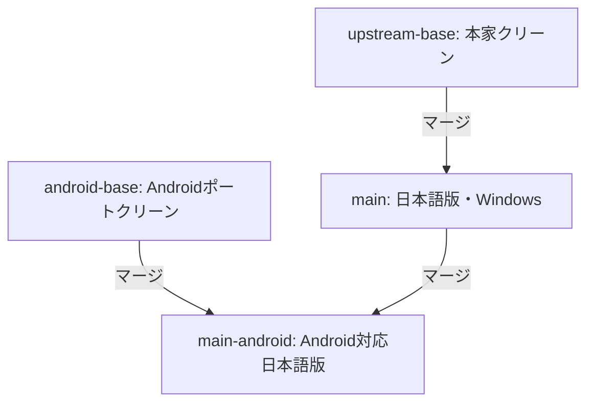

<!-- Modified by NetHackJP contributor @satokiyon; latest change date: 2026-06-26. -->
# NetHackJP 開発者向け情報

本ドキュメントは、NetHackJP プロジェクトのビルド、翻訳方針、およびリポジトリの運用に関する開発者向けの情報をまとめたものです。

---

## 🛠️ ビルドと開発環境

### 1. ビルド方法
Windows でのビルド方法の詳細は、以下のドキュメントを参照してください。
* [ビルドガイド (sys/windows/vs/build-vs.txt)](sys/windows/vs/build-vs.txt)

* **AIエージェント向けビルドコマンド**:
  - AIエージェントがビルドを行う際は、`sys/windows/vs/build_one.bat` を使用してください。このスクリプトは環境のセットアップと `Release|x64` 構成でのビルドを自動的に行います。

### 2. デバッグとLuaスクリプト検証
デバッグモード中に `#wizloadlua` を使用してLuaスクリプトからゲーム状態の取得やデバッグ操作を行う方法については、以下のドキュメントを参照してください。
* [Luaデバッグ・検証ガイド (docs/wizloadlua_guide.md)](docs/wizloadlua_guide.md)

* **Luaスクリプトを使用したテスト方針（手動テストのルール）**:
  - `wizloadlua` を用いた Lua スクリプトによる機能テストは、CI等で自動実行されるものではなく、開発者が個別に**手動**で実行するものとします。
  - 新機能の追加やバグ修正の際は、検証用の Lua スクリプト（例: `testwish.lua`）を作成または利用して、ゲーム内で `#wizloadlua` コマンドを実行し、手動でテスト結果を確認してください。
  - 自動検証の仕組化や自動実行プロセスのリポジトリへの組み込みは行わず、あくまで開発者の手元での確認補助ツールとして運用します。

### 3. Android版 (WSL + Gradle) のビルドとトラブルシューティング
Android版（`main-android` ブランチ）を WSL (`Ubuntu`) および Windows の Gradle 環境でビルドする際は、以下の構成と制約に注意してください。

* **WSLでのCライブラリビルド**:
  Cライブラリ (`libnethack.so`) は、WSL上の Android NDK と `make` を使用してビルドします。
  - **実行コマンド例 (arm64-v8aの場合)**:
    ```bash
    make NDK=/path/to/android-ndk ABI=arm64-v8a install
    ```
  - **改行コード (CRLF) のパース制限と対応**:
    Windows側のファイル改行コードが CRLF であるため、WSL (Linux) 上の `makedefs` ユーティリティでデータファイル等をパースする際、行末の `\r` が原因で `unknown identifier` や `non-printable` エラーが発生することがあります。これに対応するため、`util/makedefs.c` には行末の `\r` を自動トリミングする処理が実装されています。新しくパーサやファイルを拡張する際は、このトリミングが適切に行われていることを確認してください。

* **Android NDK (clang) における全角文字キャストエラー**:
  - **制限**: NDK コンパイラでは、`'。'` などのマルチバイト文字をシングルクォーテーションで囲んで文字定数（`char`）として定義すると `character too large` エラーになります。
  - **対策**: 全角文字や記号を条件によって切り替えて出力したい場合は、必ず文字列リテラル（例: `"。"`）を使用し、フォーマット指定子を `%c` から `%s` に変更してください。

* **Windows上の Gradle での APK パッケージング**:
  `settings.gradle` 内で Gradle Source Control を用いて外部モジュール（例: `ForkFront-Android`）を一時ディレクトリ内でビルドする際、プロジェクト内の `local.properties` に設定した `sdk.dir` が外部モジュールに引き継がれず、`SDK location not found` エラーが発生します。
  - **対策**: ビルド実行時は、必ず以下のように環境変数 `ANDROID_HOME` を設定して `gradlew` を呼び出してください。
    ```powershell
    $env:ANDROID_HOME="C:\Users\satok\AppData\Local\Android\Sdk"; .\gradlew.bat assembleDebug
    ```

* **AIエージェント向けビルドコマンド**:
  AIエージェントが Android ビルドを実行する際は、以下のコマンドを手動承認で順次実行してください。
  - **Step 1: WSLでのCライブラリコンパイルと配置**
    ```powershell
    wsl -d Ubuntu-26.04 make NDK=/home/satok/android_sdk/ndk/30.0.14904198 ABI=arm64-v8a install
    ```
    ※ NDKのバージョンやパスは環境によって固定されています。ディストリビューション名を明示的（`-d Ubuntu-26.04`）に指定してください。
  - **Step 2: Windows側での Gradle パッケージング**
    カレントディレクトリを `sys/android` に指定した上で、環境変数 `ANDROID_HOME` を設定してビルドを実行します。
    ```powershell
    $env:ANDROID_HOME="C:\Users\satok\AppData\Local\Android\Sdk"; .\gradlew.bat assembleDebug
    ```
    ※ 外部依存プロジェクト（ForkFront-Android）へSDKパスを伝播させるため、必ず環境変数 `ANDROID_HOME` を提供してください。

### 4. オブジェクト名ローカライズ方針（重要）
表示用テキスト以外にゲームロジック上でキー値として使用されている英単語は、直接日本語に置換せず、日本語の表示用リストを別途用意してヘルパー関数を利用して英単語から日本語へ変換して表示する仕組みをとっています。これによって、もともとのキー値を参照するゲームロジックが破壊されるのを防ぎます。

例えば `include/objects.h` を直接日本語化すると、Lua special floor の `des.object({ id = "leather armor" })` のような英語 ID ルックアップが壊れるため、内部IDは英語のまま維持し、表示層だけを日本語化します。

* **内部IDは英語維持**: `include/objects.h` は upstream 英語のまま保持し、Lua・wish・検索系の互換性を確保する。
* **表示だけ日本語化**: `src/obj_jp.c` に日本語名テーブル (`obj_jp_names[]`) と未識別外観テーブル (`obj_jp_descrs[]`) を持たせる。
* **表示層で切り替え**: `src/objnam.c` の表示処理は `jp_item_name()` / `jp_item_descr()` を使う。
* **シャッフル対応**: 未識別外観は `oc_descr_idx` が実行時に変わるため、`jp_item_descr()` は `objects[otyp].oc_descr_idx` を経由する。
* **Windows ビルドへの組み込み**: `sys/windows/vs/NetHack/NetHack.vcxproj` と `sys/windows/vs/NetHackW/NetHackW.vcxproj` の両方に `src/obj_jp.c` を含める。
* **アーティファクトの日本語化と願い・検索対応**: 
  - `src/obj_jp.c` に表示用の標準日本語名テーブル (`artilist_jp_names[]`) と、入力受付用のJNetHack表記の別名テーブル (`artilist_jnethack_names[]`) を用意。
  - `src/objnam.c` の `xname()` や `bare_artifactname()` では、表示時に標準日本語名に置き換える。
  - `src/artifact.c` の `artifact_name()` で入力された日本語名（表記揺れや別名を含む）を英語キー名にマッピングして「願い」に対応する。
  - `src/jp_data_lookup.c` において、データ検索用にアーティファクトの日本語名（およびひらがな表記）を英語キーに紐づける alias 設定を追加。
* **通常オブジェクトの日本語名による願い対応（JNetHack表記揺れ吸収対応）**:
  - `src/obj_jp.c` に、JNetHack式の日本語名（例：「スピードブーツ」「願いのワンド」など）から英語名にマッピングするためのエイリアステーブル (`jnh_wish_aliases[]`) を定義。
  - クラス接尾辞（「の巻物」「の指輪」など）が剥ぎ取られた部分名（例: 「識別」→ `"identify"` 等）でマッチングするようにマッピングを構成。
  - `src/obj_jp.c` の `jnh_normalize_wish()` 内で、入力された文字列に対して `jnh_wish_aliases` による**部分置換**（`str_replace`）を適用。これにより、「祝福されたつらぬき丸」のように修飾語（祝福された/呪われた等）とJNetHack風の固有名が組み合わされた入力でも、固有名部分のみを置換して正しく「願い」を認識可能。
  - `src/objnam.c` の `jp_wish_match()` 内で、正規化された文字列を段階的に英語名と比較してヒットを判定。

この設計により、英語ID依存の内部処理を壊さずに日本語表示を実現できます。チュートリアルの Lua `Unknown object id` 問題もこの方式で解消しました。

---

## 📝 翻訳方針と補足情報

### 1. プロジェクトの目標と作業方針
1. **NetHack 5.0 の画面に表示されるメッセージやテキストを日本語に翻訳する**
   * メッセージ、アイテム名、モンスター名などの日本語翻訳および表示対応を行います。
2. **Windows版が日本語でプレイできる状態にする**
3. **現在の作業方針**
   * 画面表示テキストの日本語化を優先し、内部仕様やID互換性を壊さない方針で進めます。
   * 日本語の文字コードは UTF-8 を前提とし、Windows 版の表示品質を重視します。
   * 変更は原則として最小差分で行い、表示文・訳文に関係ないロジック変更は避けます。
   * `dat/` にあるデータファイルは、日本語用に別ファイルを用意してそちらを使用します。
   * **英語固有ロジックの回避**: 英語の文法に基づいた動的な文字列操作（例: `insight.c` での `are not` → `aren't` といった短縮形への置換）は、日本語（マルチバイト文字）が含まれる場合に文字化けや不自然な結果を招く可能性があるため、マルチバイト文字が含まれる場合はこれらの処理をスキップするように実装します。
* **死因 (killer) とスコア表示**: `losehp()` 等の引数に渡す死因文字列を日本語化した場合、それらがスコア画面 (`src/topten.c`) で正しく表示されるよう、`topten.c` 内の翻訳用判定リストにも日本語を追加します。
* **中断理由 (multi_reason) と内部ロジックの整合性**: 行動中断の理由を表す `gm.multi_reason` を日本語化する場合、`src/end.c` の `death_fixups[]` などで文字列比較 (`strcmp`) を行っている箇所がないか確認し、比較対象の文字列も併せて日本語に更新する必要があります。
* **複数形処理 (makeplural) の挙動**: NetHackJP の `makeplural()` 関数には `has_nonascii()` によるガードがあり、マルチバイト文字（非ASCII文字）が含まれる文字列には英語の複数形（末尾の 's' など）を付与しない仕様になっています。そのため、通貨名やアイテム名を日本語化（カタカナ含む）しても「ゾークミッドs」のような不自然な表示にはなりません。

### 2. 翻訳時のポイント
* `src/pline.c` のメッセージ表示関数 (`You`, `Your`, `You_feel`, `You_hear`, `You_see`, `You_cant`, `There`, `pline_The`, `verbalize`, `custompline`) は、関数単体ではなく呼び出し側文字列と結合した最終表示文で自然さを確認します。
* `You_feel` / `You_hear` / `You_see` は接頭辞を自動付与するため、呼び出し側リテラルで主語重複や助詞衝突を起こさないようにします。
* `%s` の直後に助詞（`は/を/に/へ/が/の/と/から`）が来る文では、`mon_nam()/Monnam()` より `l_monnam()` の利用を優先します。
* `%s%sから` のような複合テンプレートは機械置換せず、文脈ごとに語順を手動で整えます。
* 英語冠詞を返す補助（`just_an()` など）の結果は、日本語文へ直接連結しません。
* `%s`, `%d`, `%ld`, `%c` などのフォーマット指定子は、個数・順序・型を変更しません。
* 原則として文字列リテラルのみを変更し、ゲームロジックや条件分岐の意味は変えません。
* `隠し%s` のようなテンプレートは、展開後の最終語形 (`隠し扉`, `隠し通路`) が自然か確認します。

### 3. コーディング規約とビルド対応
* **MSVC警告対応**: MSVC (Visual Studio) でのビルド時に `warning C4210` (関数内のextern宣言) などの警告が出ないよう、宣言は原則としてファイルスコープで行います。
* **日本語対応関数の命名**: 日本語化に関連する独自の補助関数には `jp_` 接頭辞（例: `jp_insight_has_nonascii`）を付与し、既存コードとの区別を明確にします。

### 4. 再発防止と品質管理
翻訳やコード修正を行う際は、以下の点に注意して問題の発生を未然に防ぎます。

*   **コミット前のビルド確認**: 変更を加えた後は、必ず `sys\windows\vs\build_one.bat` を実行してビルドが通ることを確認してください。構文エラーや未使用変数の警告などはこの段階で排除します。
*   **構文と括弧の整合性**: 大規模な翻訳やリファクタリング（特に `#if` ブロックや複雑な `if-else` 文を含む箇所）を行った後は、中括弧 `{}` や括弧 `()` の対応が崩れていないか細心の注意を払ってください。
*   **内部ロジックの再確認**: 死因 (`killer`) や中断理由 (`multi_reason`) などの内部キーとしても機能する文字列を翻訳した場合は、それらを参照している他の箇所（`topten.c` や `end.c` など）のロジックが壊れていないか、広範囲に調査して整合性を保ってください。
*   **文字コードと文字化けの防止**: ソースファイルは UTF-8 で保存し、マルチバイト文字が不自然に分割されたり、特殊な制御文字が混入したりしないように注意してください。特に、既存のメッセージを置換する際に意図しない文字（「遁0」など）が混入していないか確認してください。
*   **未使用コードの整理**: 翻訳によって不要になった変数（英語メッセージ用の `message` や `verb` など）は、放置せずに削除してコンパイラの警告を最小限に抑えてください。

---

## 🧩 独自拡張機能とアップストリーム同期

NetHackJP では、本家（アップストリーム）で未実装ながら利便性の高い機能を独自に実装している場合があります。これらは将来的にアップストリームで同様の修正が入った際、混乱を避けるために一括削除または差し替えが容易な構成にしています。

### 1. セーブデータ選択時の属性自動復元機能
ゲーム開始時のセーブデータ一覧からキャラクターを選択した際、職業・種族・性別・属性およびプレイモードを自動的に復元する機能です。

*   **マーカータグ**: `/* NetHackJP: save data restoration */`
*   **対象ファイルと削除手順**:
    1.  **`include/extern.h`**: 上記タグが付いた `select_saved_game` のプロトタイプ宣言を削除。
    2.  **`src/role.c`**: 上記タグで囲まれた `select_saved_game` 関数の実装全体を削除。
    3.  **`src/restore.c`**: `restore_menu()` 関数内の上記タグが付いた `select_saved_game` の呼び出し箇所を削除し、必要に応じてアップストリームの実装（元の `memcpy` や `Strcpy` 等）に差し替える。

### 2. セーブデータ一覧の重複表示バグの修正（Windows）
Windows版において、複数のセーブファイルが存在する際に一覧画面で同じキャラクターが重複して表示されてしまうバグの修正です。

*   **マーカータグ**: `/* NetHackJP: update buffer for each file */`
*   **対象ファイルと削除手順**:
    1.  **`src/files.c`**: `get_saved_games()` 関数内の上記タグが付いた箇所（`foundfile_buffer()` の呼び出しを含む行）を、アップストリームのコードに合わせて差し戻す。

> [!IMPORTANT]
> 上記の機能について、将来的にアップストリーム（NetHack本家）で同様のバグ修正や機能追加が行われた場合は、NetHackJP 独自の変更を維持せず、原則としてアップストリームの実装に従ってコードを刷新してください。

---

## ⚖️ ライセンスと NetHack License 2(a) への対応方針

本リポジトリは、オリジナルの NetHack 同様、NetHack General Public License に準じます。

### NetHack License 2(a) への対応方針
* 改変したファイルには、ファイル形式に適合する方法で改変通知を記載します。
* コメント記載できないファイル（`dat/` 配下のデータファイル等）は原本を直接改変せず、日本語用の別ファイル（`*_jp`）へ分離して運用します。
* `dat/` 配下の `.lua` ファイルはコメント可能なため、改変時は変更通知コメントの対象に含めます。
* 実行時は日本語用ファイルを優先し、存在しない場合は原本へフォールバックする方針を採ります。
* 原本データは保持し、変更履歴と対応関係を追跡可能な形で管理します。

* ライセンス本文: [dat/license](dat/license)
* サブモジュール等の第三者コンポーネント: [THIRD_PARTY_NOTICES](THIRD_PARTY_NOTICES)

---

## 🔄 リポジトリ運用メモ

### 1. ブランチ構成と運用
NetHack 本家（アップストリーム）および Android 移植ポートの修正を継続的に反映するため、以下のブランチで運用しています。

*   **`main`**: 日本語化プロジェクトのメイン開発ブランチ（Windows版ベース）。
*   **`upstream-base`**: 本家 (`NetHack/NetHack-5.0`) のコードをそのまま保持する同期用ブランチ（日本語独自の変更は加えません）。
*   **`android-base`**: Androidポート (`JodiJodington/NetHack-Android-master`) のコードをそのまま保持する同期用ブランチ（日本語独自の変更は加えません）。
*   **`main-android`**: 日本語化された Android 版の開発・ビルド用ブランチ。`main` と `android-base` を統合します。



### 2. 初期設定（初回のみ）
本家および Android ポートのリモートを登録し、同期用ブランチを作成します。
```powershell
# 1. 本家およびAndroidポートのリモートリポジトリを登録
git remote add upstream https://github.com/NetHack/NetHack.git
git remote add android-port https://github.com/JodiJodington/NetHack-Android.git
git fetch --all

# 2. 同期用ブランチを作成
git checkout -b upstream-base upstream/NetHack-5.0
git checkout -b android-base android-port/master

# 3. 開発ブランチの作成とマージ
git checkout main
git checkout -b main-android
git merge --no-commit --no-ff android-base
# ※ 競合（config.h や files.c 等）を手動解決してコミット
git commit -m "Androidポートの初期マージ"
```

### 3. 本家 (upstream) 更新の main ブランチへの同期 (定期実行)
本家 NetHack 側の更新を日本語版メイン (`main`) に取り込み、Windows版でのビルド・動作を確認します。
```powershell
# 1. upstream-base を最新にする
git switch upstream-base
git pull upstream NetHack-5.0

# 2. main にマージする
git switch main
git merge --no-commit --no-ff upstream-base

# 3. コンフリクトが発生した場合（競合を手動解決後）
git add <解決したファイル名>
git commit -m "アップストリームの変更をマージ"

# 4. 動作確認後にプッシュ
git push origin main

# （補足）マージを中断して作業前の状態に戻す場合
git merge --abort
```

### 4. Android版 (main-android) の同期・統合手順 (定期実行)
本家更新による日本語版メイン (`main`) の変更、または Android ポート (`android-base`) 側の変更を、Android日本語版開発ブランチ (`main-android`) に統合します。

```powershell
git switch main-android

# ----------------------------------------------------
# Step A: 日本語版の最新変更 (main) をマージ
# ----------------------------------------------------
git merge --no-commit --no-ff main
# ※ 競合（表示・ローカライズ処理の差分など）が発生した場合は手動解決
git add <解決したファイル名>
git commit -m "mainブランチの更新を統合"

# ----------------------------------------------------
# Step B: Androidポートの最新変更 (android-base) をマージ
# ----------------------------------------------------
# 1. まず同期用ブランチを最新化
git switch android-base
git pull android-port master
git switch main-android

# 2. マージを実行
git merge --no-commit --no-ff android-base
# ※ 競合が発生した場合は手動解決
git add <解決したファイル名>
git commit -m "Androidポートの更新を統合"

# ----------------------------------------------------
# Step C: ビルド確認とプッシュ
# ----------------------------------------------------
# WSL上でCライブラリをビルドし、Windows上でGradleビルドが通ることを確認後にプッシュします
git push origin main-android
```
