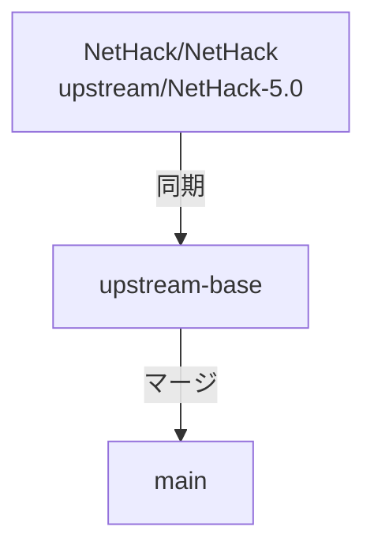

<!-- Modified by NetHackJP contributor @satokiyon; latest change date: 2026-06-29. -->
# NetHackJP 開発メモ

本ドキュメントは、Windows ポート（CUI/GUI）の日本語化リポジトリである `NetHackJP` の開発環境の構築、ビルド、マージ運用およびリリース手順についてまとめたものです。

---

## 1. 開発環境の要件（事前準備）

ビルドを実行する前に、以下のソフトウェアを Windows 環境にインストールし、セットアップを完了させてください。

- **Visual Studio** (MSVC)
  - インストール時に「C++ によるデスクトップ開発」ワークロードを選択してください。
- **CMake**
  - ビルド設定の生成に必要です。インストール時にシステム PATH へ追加するオプションを選択するか、手動で PATH を通してください。
- **Git for Windows**

---

## 2. Windows ポートの開発・ビルドの実行

リポジトリに用意されている開発者用のバッチファイルを実行することで、ビルドとテストを安全に行うことができます。
- **実行スクリプト**: `sys/windows/vs/build_one.bat`
- このスクリプトは、MSVCのビルド環境（`Release|x64`）を自動セットアップした上で一貫したビルドを行います。

---

## 3. 翻訳方針と補足情報

### 日本語助詞とモノ名の連結問題
* `You_feel` / `You_hear` / `You_see` は接頭辞を自動付与するため、呼び出し側リテラルで主語重複や助詞衝突を起こさないようにします。
* `%s` の直後に助詞（`は/を/に/へ/が/の/と/から`）が来る文では、`mon_nam()` / `Monnam()` より `l_monnam()` の利用を優先します。
* `%s%sから` のような複合テンプレートは機械置換せず、文脈ごとに語順を手動で整えます。
* 英語冠詞を返す補助（`just_an()` など）の結果は、日本語文へ直接連結しません。
* `%s`, `%d`, `%ld`, `%c` などのフォーマット指定子は、個数・順序・型を変更しません。
* 原則として文字列リテラルのみを変更し、ゲームロジックや条件分岐の意味は変えません。
* `隠し%s` のようなテンプレートは、展開後の最終語形 (`隠し扉`, `隠し通路`) が自然か確認します。

### コーディング規約とビルド対応
* **MSVC警告対応**: MSVC (Visual Studio) でのビルド時に `warning C4210` (関数内のextern宣言) などの警告が出ないよう、宣言は原則としてファイルスコープで行います。
* **日本語対応関数の命名**: 日本語化に関連する独自の補助関数には `jp_` 接頭辞（例: `jp_insight_has_nonascii`）を付与し、既存コードとの区別を明確にします。

### 再発防止と品質管理
翻訳やコード修正を行う際は、以下の点に注意して問題の発生を未然に防ぎます。

* **コミット前のビルド確認**: 変更を加えた後は、必ず `sys\windows\vs\build_one.bat` を実行してビルドが通ることを確認してください。構文エラーや未使用変数の警告などはこの段階で排除します。
* **構文と括弧の整合性**: 大規模な翻訳やリファクタリングを行った後は、中括弧 `{}` や括弧 `()` の対応が崩れていないか細心の注意を払ってください。
* **内部ロジックの再確認**: 死因 (`killer`) や中断理由 (`multi_reason`) などの内部キーとしても機能する文字列を翻訳した場合は、それらを参照している他の箇所（`topten.c` や `end.c` など）のロジックが壊れていないか、広範囲に調査して整合性を保ってください。
* **文字コードと文字化けの防止**: ソースファイルは UTF-8 で保存し、マルチバイト文字が不自然に分割されたり、特殊な制御文字が混入したりしないように注意してください。
* **未使用コードの整理**: 翻訳によって不要になった変数（英語メッセージ用の `message` や `verb` など）は、放置せずに削除してコンパイラの警告を最小限に抑えてください。

---

## 4. 独自拡張機能とアップストリーム同期

NetHackJP では、本家（アップストリーム）で未実装ながら利便性の高い機能を独自に実装している場合があります。これらは将来的にアップストリームで同様の修正が入った際、混乱を避けるために一括削除または差し替えが容易な構成にしています。

### 1. セーブデータ選択時の属性自動復元機能
ゲーム開始時のセーブデータ一覧からキャラクターを選択した際、職業・種族・性別・属性およびプレイモードを自動的に復元する機能です。
* **マーカータグ**: `/* NetHackJP: save data restoration */`
* **対象ファイルと削除手順**:
  1. **`include/extern.h`**: `select_saved_game` のプロトタイプ宣言を削除。
  2. **`src/role.c`**: `select_saved_game` 関数の実装全体を削除。
  3. **`src/restore.c`**: `restore_menu()` 関数内の `select_saved_game` の呼び出し箇所を削除。

### 2. セーブデータ一覧の重複表示バグの修正（Windows）
Windows版において、複数のセーブファイルが存在する際に一覧画面で同じキャラクターが重複して表示されてしまうバグの修正です。
* **マーカータグ**: `/* NetHackJP: update buffer for each file */`
* **対象ファイルと削除手順**:
  1. **`src/files.c`**: `get_saved_games()` 関数内の `foundfile_buffer()` の呼び出し箇所をアップストリームに合わせて差し戻し。

---

## 5. ライセンスと NetHack License 2(a) への対応方針

本リポジトリは、オリジナルの NetHack 同様、NetHack General Public License に準じます。

### NetHack License 2(a) への対応方針
* 改変したファイルには、ファイル形式に適合する方法で改変通知を記載します。
* コメント記載できないファイル（`dat/` 配下のデータファイル等）は原本を直接改変せず、日本語用の別ファイル（`*_jp`）へ分離して運用します。
* `dat/` 配下の `.lua` ファイルはコメント可能なため、改変時は変更通知コメントの対象に含めます。
* 実行時は日本語用ファイルを優先し、存在しない場合は原本へフォールバックする方針を採ります。
* 原本データは保持し、変更履歴と対応関係を追跡可能な形で管理します。

* ライセンス本文: [dat/license](dat/license)
* サブモジュール等の第三者コンポーネント: [THIRD_PARTY_NOTICES](THIRD_PARTY_NOTICES)

---

## 6. リポジトリ構成とマージ運用

本リポジトリは Windows ポート用の日本語化リポジトリであり、本家 NetHack（アップストリーム）の変更を取り込みながら開発を進めます。



### リモート設定
マージ作業を行う前に、以下のリモート設定を確認してください。
- **`origin`**: `https://github.com/satokiyon/NetHackJP.git` (自身のWindows日本語化リポジトリ)
- **`upstream`**: `https://github.com/NetHack/NetHack.git` (本家NetHackオリジナルリポジトリ)

設定されていない場合は、以下のコマンドで追加します。
```bash
git remote add upstream https://github.com/NetHack/NetHack.git
git fetch --all
```

### マージの手順（定期実行）

本家 NetHack 側の更新を日本語版メイン (`main`) に取り込み、Windows版でのビルド・動作を確認します。

1. **同期用クリーンブランチ（`upstream-base`）を最新にする**
   ```bash
   git switch upstream-base
   git pull upstream NetHack-5.0
   ```
2. **`main` ブランチにマージする**
   ```bash
   git switch main
   git merge --no-commit --no-ff upstream-base
   ```
3. **競合（コンフリクト）が発生した場合**
   - 競合を手動で解決します。
   - `sys/windows/vs/build_one.bat` を実行し、コンパイルエラーやリンクエラーがないことを確認します。
   - 解消後、変更をインデックスに追加してコミットします。
     ```bash
     git add .
     git commit -m "Merge upstream changes into main"
     ```
4. **プッシュ**
   ```bash
   git push origin main
   ```

---

## 7. リリース手順

### リリース用バイナリのビルド
`sys/windows/vs/build_one.bat` を用いて、`Release|x64` または `Release|Win32` で最終パッケージ用バイナリをビルドします。

### タグの作成とプッシュ
リリース用コミットが `main` ブランチにプッシュされた後、リリース用タグを作成してプッシュします。
- タグ命名規則: `NetHackJP-[Version]-[Date]` (例: `NetHackJP-5.0.0-20260629`)
```bash
git tag NetHackJP-5.0.0-20260629
git push origin NetHackJP-5.0.0-20260629
```

### GitHub Release の作成
GitHub上の Releases ページから新規リリースを作成し、ビルドされた Windows 用バイナリをアタッチして公開します。
