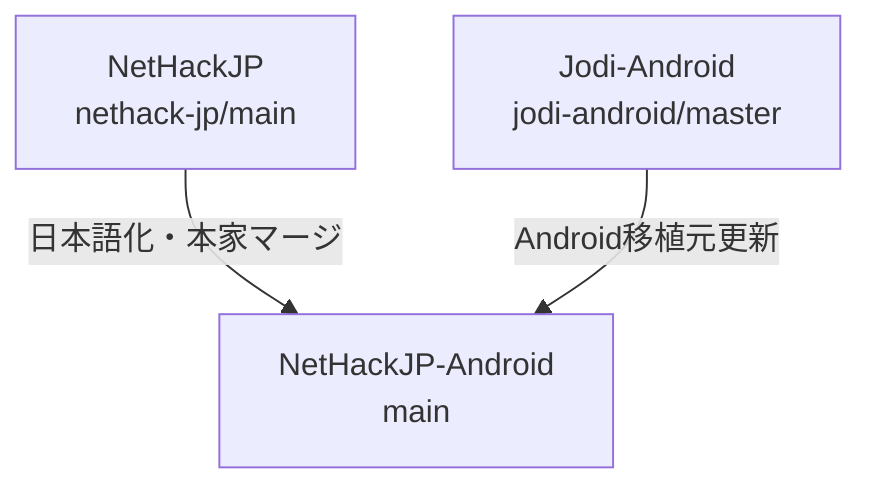

<!-- Modified by NetHackJP contributor @satokiyon; latest change date: 2026-07-10. -->
# NetHackJP-Android 開発メモ

本ドキュメントは、Android ポートの日本語化リポジトリである `NetHackJP-Android` の開発環境の構築、ビルド、マージ運用およびリリース手順についてまとめたものです。

---

## 1. 開発環境の要件（事前準備）

ビルドを実行する前に、Windows環境およびWSL環境に以下のソフトウェアをインストールし、セットアップを完了させてください。

### Windows 環境
- **Android Studio** (または Android SDK Command-Line Tools)
  - Android SDK が必要です。通常は `C:\Users\<ユーザー名>\AppData\Local\Android\Sdk` に配置されます。
- **Java Development Kit (JDK)**
  - Gradle の動作に必要な JDK (Java 17 以上を推奨) をインストールしてください（Android Studio 同梱のものでも構いません）。
- **Git for Windows**
- **PowerShell** (自動ビルドスクリプトの実行に必要)

### WSL 環境 (Windows Subsystem for Linux)
- **Ubuntu** (ビルド自動化スクリプトは `Ubuntu-26.04` ディストリビューションをデフォルトとして動作します)
- WSLのUbuntu上に、Cライブラリコンパイルに必要なパッケージ群をインストールしてください。
  ```bash
  sudo apt update
  sudo apt install build-essential curl
  ```

---

## 2. 開発手順とビルド

### 依存サブモジュールの準備
Android ビルドを行う前に、外部依存サブモジュールをチェックアウト・更新してください。
```bash
git submodule update --init --recursive
```

### 自動ビルドスクリプトの実行
PowerShell から、リポジトリルートにあるビルド自動化スクリプトを実行します。
```powershell
$env:ANDROID_HOME="C:\Users\satok\AppData\Local\Android\Sdk"; .\sys\android\build_android.ps1
```
- **内部処理**:
  1. WSL (Ubuntu-26.04) 上で `sys/android/setup.sh` を実行し、必要な Makefile 群を自動生成・ルートに配置します。
  2. WSL 上で `make fetch-lua` を実行し、依存する Lua 5.4.8 ライブラリを取得します。
  3. C ソースコードをコンパイルし、静的ライブラリ（`nethack.a`）などをビルドします。
  4. Windows 側で Gradle (`gradlew.bat`) を用いて JNI 連携と APK のパッケージング（デバッグビルド）を行います。

### データファイルの変更・追加時
- `/dat/options` や `/dat/rumors_jp` などのテキストファイルを変更または追加した場合は、端末へのアセット上書きコピーを強制するため、必ず `sys/android/app/assets/ver` の中にある数値（整数値）をインクリメント（+1）してください。
- 端末内に古いアセットがキャッシュされていると、変更が反映されません。

---

## 3. 技術上の注意点

### NDK (clang) における全角文字キャストエラー
- **制限**: NDK コンパイラでは、`'。'` などのマルチバイト文字をシングルクォーテーションで囲んで文字定数（`char`）として定義すると `character too large` エラーになります。
- **対策**: 全角文字や記号を条件によって切り替えて出力したい場合は、必ず文字列リテラル（例: `"。"`）を使用し、フォーマット指定子を `%c` から `%s` に変更してください。

### CP437デコーダの無効化（日本語文字化け対策）
- Android版 NetHack は `sys/android/app/res/values/config.xml` の `useCP437Decoder` が `true` の場合、テキスト出力を CP437 としてデコードします。日本語テキストは UTF-8 でエンコードされているため、CP437 デコードでは文字化けが発生します。
- **対策**: `useCP437Decoder` を **`false`** に設定してください。上流リポジトリの同期時にこの設定が巻き戻らないよう注意が必要です。

### FALLTHROUGH マクロの NDK (clang) 互換性
- `include/tradstdc.h` の `FALLTHROUGH` マクロ定義が `__attribute__((fallthrough))` のみだと、特定の文脈（`case` ラベル直後など）で NDK の clang が「expected expression」エラーを出すことがあります。
- **対策**: マクロ定義の先頭にセミコロンを付与し、`; __attribute__((fallthrough))` とします。

### defaults.nh のオプション名エイリアス整合性
- `sys/android/defaults.nh` で日本語版独自のステータス表示オプションを使用する場合、`src/botl.c` 内のフィールド名テーブルに対応するエイリアスが登録されていないと、起動時に警告が出力されます。エイリアスの登録漏れに注意してください。

### Flutter版のヘルプメニュー表示経路
- `?` メニューの項目はすべて同じ経路ではなく、`NetHackについて` や `ゲームオプション一覧` のように `display_file()` へ進むものと、`ゲームオプションの詳細説明` のように `NHW_TEXT` に直接出力されるものが混在しています。
- Flutter ポートでは `win_display_file` を必ず実装し、Java版と同じくヘルプファイルを `NHW_TEXT` に流し込んで表示してください。`display_file()` を未実装にすると、`?` メニューの一部だけが表示されない不具合になります。
- `display_nhwindow()` は Java版と同様に、`WIN_MESSAGE` / `WIN_STATUS` / `WIN_MAP` 以外のウィンドウでは強制的に blocking 扱いにしてください。これを外すと、ヘルプ本文が表示直後に破棄されて見えなくなります。

### Flutter版の PICK_ANY メニュー見出しと選択行
- `PICK_ANY` のメニューには、カテゴリ見出しや区切り行と、実際に選択できるアイテム行が混在します。
- `ident == 0` の行は選択対象ではない見出し・区切りとして扱い、チェックボックスや選択ハイライトの対象にしないでください。
- 見出し行は別スタイルで描画し、食料・魔法書などのカテゴリ名と個別アイテムの違いが見た目で分かるようにしてください。

### Flutter版 DPad の移動モード互換（Java版準拠）
- Flutter の DPad は Java版と同様に、方向キーラベルを固定矢印ではなく可変文字列で描画し、移動モードに応じて `yuhjklbn` / `12346789` / `g+方向` / `G+方向` / `^+方向` / `m+方向` / `F+方向` を切り替えて表示してください。
- 中央ボタンは Java版同様に「短押し: 有効モード循環」「長押し: 使用する移動モード選択ダイアログ表示」を割り当てます。利用可能モードは最低でも `NORMAL,UPPER,G_LOWER,G_UPPER,CTRL,M_CMD,F_CMD` を扱えるようにします。
- 設定キーは Java版と揃えて `dpad_move_mode` と `dpad_enabled_move_modes` を使用し、Flutter 側でも同じフォーマット（カンマ区切りの enum 名）で保存・復元します。これにより Android(Java) と Flutter 間で設定互換を保てます。
- DPad の方向ロング押しは Java版同様に `g<dir>`（走る）を送る挙動を基本とします。

### Flutter版 方向問い合わせ時の入力ルール
- `winflutter.c` の `flutter_yn_function()` は「どの方向 / what direction」を通常のYNダイアログとして送らず、`WIN_MESSAGE` に文面を出して `flutter_nhgetch()` で直接1キー待機します。
- このため Flutter UI 側では、方向問い合わせ中は移動モード設定に関係なく `yuhjklbn` をそのまま送信する必要があります（`G` や `^` などの前置コマンドを送らない）。
- 方向問い合わせ中判定は、少なくとも `WIN_MESSAGE` への `putstr` 文面に `what direction` / `どの方向` が含まれるかで追跡してください。

### Flutter版 複合キー送信（前置コマンド + 方向）時の待機制御
- `g<dir>` / `m<dir>` / `F<dir>` のように2キー連続送信する場合、1キー目送信で入力待機フラグを落とすと2キー目が送れなくなるため、UI 側送信関数に「待機解除しない送信（prefix送信用）」を用意してください。
- 最終キー送信時だけ待機解除する設計にすると、Java版と同様の移動モード入力を安定して再現できます。

### Flutter版キーボードの4レイアウト設計（Java版準拠）
- Flutter版の仮想キーボード（`nethack_keyboard.dart`）は、Java版（`SoftKeyboard.java`）と同様に **QWERTY / Symbols / Meta / Ctrl の4レイアウト**を切り替えて使用します。Meta や Ctrl をトグル修飾子（次の1キーだけを変換する方式）ではなく、**専用レイアウトに切り替える方式**にしてください。
- **Meta キー**: `char | 0x80`（128〜255）のコードを `onRawKeyCode` で直接送信します。例えば `M-a` = 225、`M-2` = 178 です。NetHack のメタコマンド（`M-c` = chat、`M-o` = open、`M-v` = invoke 等）はこの形式で送信されます。
- **Ctrl キー**: `char & 0x1F`（1〜26）の制御コードを `onRawKeyCode` で直接送信します。例えば `^A` = 1、`^D` = 4、`^P` = 16 です。
- **ESC キー**: ASCII 27 を `onRawKeyCode` で送信します。Symbols / Meta / Ctrl レイアウトの下段に配置してください。
- **ゲーム必須キー**: QWERTY 下段に `<` `>` `:` `,` を、Symbols レイアウトに `#` `@` `$` `^` `[` `+` `/` `?` `.` `*` を配置し、NetHack の主要コマンド（階段昇降、look、pick up、拡張コマンド、autopickup、呪文、what-is 等）をキーボードから直接入力できるようにしてください。

### Flutter Colors スウォッチの null 安全性問題
- Flutter の `Colors.grey` などの Material Color スウォッチは、**有効なインデックスが 50, 100, 200, 300, 400, 500, 600, 700, 800, 850, 900 のみ**です。`Colors.grey[950]` のように存在しないインデックスを指定すると `null` を返します。
- この `null` に対して `!`（null check 演算子）を使用すると、実行時に **"Null check operator used on a null value"** エラーが発生し、Flutter のエラーウィジェット（真っ赤な画面）が表示されます。ゲーム画面全体が赤く覆われ、キーボードも表示されなくなります。
- **対策**: `Colors.grey[950]!` のような記述を避け、`const Color(0xFF121212)` のように **`const Color(...)` 定数**を使用して色を指定してください。これにより null 安全性が保証され、コンパイル時定数として効率的に扱われます。

### Flutter版 マップタップ時のメニュー表示（Java版 PosCmd 送信方式の踏襲）
- Java版（`NHW_Map.onTouched` → `mNHState.sendPosCmd(x, y)` → `NetHackIO.sendPosCmd` → Cコア `and_nh_poskey` → `click_to_cmd` → `therecmdmenu` → メニュー）と互換のフローを採用しています。
- **してはいけない実装**: 拡張コマンド `#herecmdmenu` の文字列を 1 文字ずつ送信する方式。Flutter版 `get_ext_cmd` は `flutter_do_ext_cmd_menu` (= 拡張コマンド一覧を即座にメニュー起動) でハイジャックされており、文字列補完を行う `extcmd_via_menu` とは挙動が異なります。結果として、`#` 受信時に拡張コマンド一覧が起動し、メニューが見えないまま残り文字 (`h e r e c m d m e n u`) が `doread`/`doeat`/`doclose` 等の個別コマンドとして連続実行され、`doclose` の「どの方向ですか?」プロンプトが出力されるなど、UX 破壊が発生します。
- **正しい実装**: Cコアに `SendPosCmdToFlutter(x, y, mod)` 関数を追加し、Dart側 `sendPosCmd` 経由で PosCmd キュー（リングバッファ）に積み、`flutter_nh_poskey` が消費して `readchar_core` の `sym == 0` 経路（`click_to_cmd`）経由で `therecmdmenu` → `here_cmd_menu`（主人公タイル一致時）を起動します。
- 主人公の座標判定には C側 `flutter_cliparound` から Dart側 `setPlayerPos` へ通知される `(u.ux - 1, u.uy)`（0-based マップグリッド座標）を使用します。

### Flutter版 `nhgetch` 戻り値 0 と `readchar_core` のクリックイベント処理
- NetHack の `readchar_core`（`src/cmd.c`）は `sym = nh_poskey(x, y, mod);` の戻り値が 0 の場合を**クリックイベント**として扱い、`click_to_cmd(*x, *y, *mod)` を呼び出します。`nhgetch` 戻り値 0 も同様にクリックイベントとして処理されますが、`nhgetch` からは `x, y, mod` ポインタ経由で座標を渡せません。
- Flutter版では、PosCmd を `flutter_nhgetch` 側で先に消費し、座標情報を `g_pending_poscmd_x/y/mod` グローバル変数に退避した上で `nhgetch` 戻り値 0 を返します。次の `readchar` サイクルで `flutter_nh_poskey` が `g_pending_poscmd` を確認し、座標を復元してクリックイベント（戻り値 0）として `readchar_core` に渡します。
- **副作用**: 1 回目の `readchar` で `nhgetch` が 0 を返した時点で `readchar_core` が `click_to_cmd(u.ux, u.uy, 0)` を呼び出し（`mod=0` は無効なクリック種別）、`nhbell`（ベル音）が 1 回鳴ります。機能上の問題はありません（2 回目の `readchar` で pending PosCmd が復元されて正常なメニューが起動する）が、ユーザーには「ベル音が鳴る」程度の副作用として観測されます。完全除去には NetHack 内部の変更が必要で、今回は見送っています。

### Flutter版 マップ座標の座標系統一
- 主人公位置・タップ座標は **すべて 0-based マップグリッド座標系**で扱ってください。C 側 `flutter_cliparound` で `u.ux - 1` して 0-based に変換し、Dart 側 `setPlayerPos(x, y)` に渡します（`u.ux` は 1-based、`u.uy` は 0-based のため、グリッド表示に合わせて x だけ `-1`）。
- 主人公の同一タイル判定は `_handleMapTap` 内で `dx == 0 && dy == 0` で行います。Java 版の `mSelfRadiusSquared` 相当の半径判定は未実装（タイル座標完全一致のみ）ですが、必要に応じて `dx * dx + dy * dy <= radius * radius` 形式で拡張可能です。

---

## 4. オブジェクト名ローカライズ方針

表示用テキスト以外にゲームロジック上でキー値として使用されている英単語は、直接日本語に置換せず、日本語の表示用リストを別途用意してヘルパー関数を利用して英単語から日本語へ変換して表示する仕組みをとっています。

* **内部IDは英語維持**: `include/objects.h` は upstream 英語のまま保持し、Lua・wish・検索系の互換性を確保します。
* **表示だけ日本語化**: `src/obj_jp.c` に日本語名テーブル (`obj_jp_names[]`) と未識別外観テーブル (`obj_jp_descrs[]`) を持たせます。
* **表示層で切り替え**: `src/objnam.c` の表示処理は `jp_item_name()` / `jp_item_descr()` を使います。
* **願い（Wish）および表記揺れ対応**:
  - `src/obj_jp.c` に、JNetHack式の日本語名（例：「スピードブーツ」「願いのワンド」など）から英語名にマッピングするためのエイリアステーブル (`jnh_wish_aliases[]`) を定義します。
  - `jnh_normalize_wish()` で入力された日本語に対して部分置換を適用し、「修飾語（祝福された等）＋日本語名」の組み合わせでも正しく「願い」を認識できるようにします。

---

## 5. リポジトリ構成とマージ運用

本リポジトリは、Windows版日本語化リポジトリ `NetHackJP` と、Android移植元の `JodiJodington/NetHack-Android` の2つを統合し、`main` ブランクで一本化して開発を進めます。



### リモート設定
マージ作業を行う前に、以下のリモート設定を確認してください。
- **`origin`**: `https://github.com/satokiyon/NetHackJP-Android.git` (自身のAndroidリポジトリ)
- **`nethack-jp`**: `https://github.com/satokiyon/NetHackJP.git` (日本語翻訳・共通処理元)
- **`jodi-android`**: `https://github.com/JodiJodington/NetHack-Android.git` (Android移植元)

設定されていない場合は、以下のコマンドで追加します。
```bash
git remote add nethack-jp https://github.com/satokiyon/NetHackJP.git
git remote add jodi-android https://github.com/JodiJodington/NetHack-Android.git
git fetch --all
```

### マージのルール
> [!IMPORTANT]
> 競合（コンフリクト）が発生した場合のデバッグを容易にし、Gitの変更履歴をクリーンに保つため、**`nethack-jp` からのマージと `jodi-android` からのマージは、絶対に同じコミットにまとめず、個別に実行してコミットを分けてください**。

#### A. 日本語化（NetHackJP）の更新を取り込む手順
`NetHackJP` 側で NetHack 本家の更新や、日本語翻訳データの修正が行われた場合、それを取り込みます。

1. `nethack-jp` から最新のコミットをフェッチします。
   ```bash
   git fetch nethack-jp
   ```
2. `main` ブランチにいることを確認し、マージを実行します。
   ```bash
   git checkout main
   git merge nethack-jp/main -m "Merge updates from NetHackJP (main)"
   ```
3. 競合が発生した場合は手動で解消し、ビルドテストを行った上でコミットします。

#### B. Android移植元（JodiJodington/NetHack-Android）の更新を取り込む手順
Android 移植元のバグ修正や機能追加を取り込みます。

1. `jodi-android` から最新のコミットをフェッチします。
   ```bash
   git fetch jodi-android
   ```
2. `main` ブランチにいることを確認し、マージを実行します。
   ```bash
   git checkout main
   git merge jodi-android/master -m "Merge updates from JodiJodington/NetHack-Android (master)"
   ```
3. 競合が発生した場合は手動で解消し、ビルドテストを行った上でコミットします。

### 競合（コンフリクト）が発生しやすい箇所と対処
- **`sys/share/unixtty.c` / `src/tty.c`**
  - Android版の仮想ターミナル制御と Windows/TUI 側の制御ロジックでコードが衝突しやすい部分です。競合時は Android 側の挙動を壊さないように慎重にマージしてください。
- **`sys/android/` 以下のリソースやビルド設定ファイル**
  - 日本語化固有の調整（レイアウト XML やキーボード対策）を入れているため、Jodi-Android側の更新と衝突した場合は日本語化側のコードを優先またはマージしてください。
- **コンフリクト解消後のビルド検証**
  - 競合を解消した後は、必ず `./sys/android/build_android.ps1` を実行し、Cビルド・Gradleビルドの双方がエラーなく成功することを確認した上でプッシュしてください。

---

## 6. リリース・タグ手順

### リリース用 APK のビルド
1. リリース用キーストアの署名情報を環境変数または `local.properties` に準備します。
2. 以下の Gradle タスクを実行してリリース用バイナリをビルドします。
   ```powershell
   cd sys/android
   $env:ANDROID_HOME="C:\Users\satok\AppData\Local\Android\Sdk"; .\gradlew assembleRelease
   ```

### タグの作成とプッシュ
リリース用コミットが `main` ブランチにプッシュされた後、リリース用タグを作成してプッシュします。
- Android版のタグ命名規則: `NetHackJP-Android-[Version]-[Date]` (例: `NetHackJP-Android-5.0.0-20260629`)
```bash
git tag NetHackJP-Android-5.0.0-20260629
git push origin NetHackJP-Android-5.0.0-20260629
```

### GitHub Release の作成
GitHub上の Releases ページから新規リリースを作成し、ビルドされた APK ファイル（`sys/android/app/build/outputs/apk/release/app-release.apk`）をアタッチして公開します。

---

## 7. 今後の課題・将来の検討事項

### 骨ファイル（Bones）のオンライン共有
- ゲーム内の骨ファイル（bones）をインターネット経由で他のプレイヤーと交換・共有する機能（Java版の Hearse 連携相当）については、通信の暗号化（HTTPS）やファイル名の検証を含むセキュリティ上の堅牢性確保、およびデバイス間のパース仕様の整合性を十分に考慮した上で、将来的な導入を検討します。

### タイルモードでの境界線ちらつき（テクスチャブリーディング）対策
- Flutter版のタイル表示モードにおいて、マップを拡大・縮小（ズーム）またはスクロールする際に、隣接するタイルの継ぎ目（境界線）に隙間が生じて背景色が露出したり、タイル画像ファイル（テクスチャアトラス）内の隣り合うタイルの端の色（青・緑・白など）が混入してグリッド状にちらついて表示される問題があります。
- この問題の解決には、Canvas 描画時のピクセル境界の厳密な補正、あるいはテクスチャサンプリング時に隣接ピクセルがブリーディングしないようアトラス画像の配置（マージン/パディング）を考慮する等、レンダリングおよびアセット設計の抜本的な見直しを含めて将来的なToDoとして対応を検討します。
- 上記が事象の原因であるかどうかは推測であり、実際は事象の事実確認から進める必要がある。
- 人間から見える事象としては、タイルの境界にグリッド線が表示されるように見える。拡大縮小したりマップをスクロールすると表示されたりされなかったり色が変わったりしてちらつき、表示された状態でスクロールを止めるとそのままずっと表示されている。未探索領域だけではなく、壁や扉などのマップ画像の境界にも青や緑や白の線が表示される。


