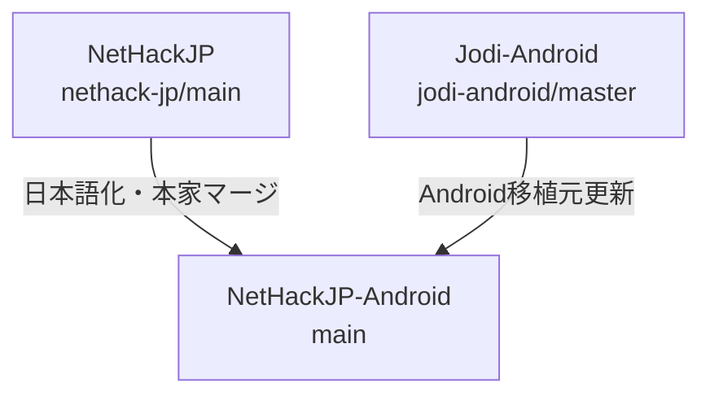

<!-- Modified by NetHackJP contributor @satokiyon; latest change date: 2026-06-29. -->
# NetHackJP-Android 開発メモ

本ドキュメントは、Android ポートの日本語化リポジトリである `NetHackJP-Android` の開発環境の構築、ビルド、マージ運用およびリリース手順についてまとめたものです。

---

## 1. 開発環境の要件（事前準備）

ビルドを実行する前に、Windows環境およびWSL環境に以下のソフトウェアをインストールし、セットアップを完了させてください。

### Windows 環境
- **Android Studio** (または Android SDK Command-Line Tools)
  - Android SDK が必要です。通常は `C:\Users\<ユーザー名>\AppData\Local\Android\Sdk` に配置されます。
- **Java Development Kit (JDK)**
  - Gradle の動作に必要な JDK (Java 17 以上を推奨) をインストールしてください（Android Studio 同梱のものでも構いません）。
- **Git for Windows**
- **PowerShell** (自動ビルドスクリプトの実行に必要)

### WSL 環境 (Windows Subsystem for Linux)
- **Ubuntu** (ビルド自動化スクリプトは `Ubuntu-26.04` ディストリビューションをデフォルトとして動作します)
- WSLのUbuntu上に、Cライブラリコンパイルに必要なパッケージ群をインストールしてください。
  ```bash
  sudo apt update
  sudo apt install build-essential curl
  ```

---

## 2. 開発手順とビルド

### 依存サブモジュールの準備
Android ビルドを行う前に、外部依存サブモジュールをチェックアウト・更新してください。
```bash
git submodule update --init --recursive
```

### 自動ビルドスクリプトの実行
PowerShell から、リポジトリルートにあるビルド自動化スクリプトを実行します。
```powershell
$env:ANDROID_HOME="C:\Users\satok\AppData\Local\Android\Sdk"; .\sys\android\build_android.ps1
```
- **内部処理**:
  1. WSL (Ubuntu-26.04) 上で `sys/android/setup.sh` を実行し、必要な Makefile 群を自動生成・ルートに配置します。
  2. WSL 上で `make fetch-lua` を実行し、依存する Lua 5.4.8 ライブラリを取得します。
  3. C ソースコードをコンパイルし、静的ライブラリ（`nethack.a`）などをビルドします。
  4. Windows 側で Gradle (`gradlew.bat`) を用いて JNI 連携と APK のパッケージング（デバッグビルド）を行います。

### データファイルの変更・追加時
- `/dat/options` や `/dat/rumors_jp` などのテキストファイルを変更または追加した場合は、端末へのアセット上書きコピーを強制するため、必ず `sys/android/app/assets/ver` の中にある数値（整数値）をインクリメント（+1）してください。
- 端末内に古いアセットがキャッシュされていると、変更が反映されません。

---

## 3. 技術上の注意点

### NDK (clang) における全角文字キャストエラー
- **制限**: NDK コンパイラでは、`'。'` などのマルチバイト文字をシングルクォーテーションで囲んで文字定数（`char`）として定義すると `character too large` エラーになります。
- **対策**: 全角文字や記号を条件によって切り替えて出力したい場合は、必ず文字列リテラル（例: `"。"`）を使用し、フォーマット指定子を `%c` から `%s` に変更してください。

### CP437デコーダの無効化（日本語文字化け対策）
- Android版 NetHack は `sys/android/app/res/values/config.xml` の `useCP437Decoder` が `true` の場合、テキスト出力を CP437 としてデコードします。日本語テキストは UTF-8 でエンコードされているため、CP437 デコードでは文字化けが発生します。
- **対策**: `useCP437Decoder` を **`false`** に設定してください。上流リポジトリの同期時にこの設定が巻き戻らないよう注意が必要です。

### FALLTHROUGH マクロの NDK (clang) 互換性
- `include/tradstdc.h` の `FALLTHROUGH` マクロ定義が `__attribute__((fallthrough))` のみだと、特定の文脈（`case` ラベル直後など）で NDK の clang が「expected expression」エラーを出すことがあります。
- **対策**: マクロ定義の先頭にセミコロンを付与し、`; __attribute__((fallthrough))` とします。

### defaults.nh のオプション名エイリアス整合性
- `sys/android/defaults.nh` で日本語版独自のステータス表示オプションを使用する場合、`src/botl.c` 内のフィールド名テーブルに対応するエイリアスが登録されていないと、起動時に警告が出力されます。エイリアスの登録漏れに注意してください。

---

## 4. オブジェクト名ローカライズ方針

表示用テキスト以外にゲームロジック上でキー値として使用されている英単語は、直接日本語に置換せず、日本語の表示用リストを別途用意してヘルパー関数を利用して英単語から日本語へ変換して表示する仕組みをとっています。

* **内部IDは英語維持**: `include/objects.h` は upstream 英語のまま保持し、Lua・wish・検索系の互換性を確保します。
* **表示だけ日本語化**: `src/obj_jp.c` に日本語名テーブル (`obj_jp_names[]`) と未識別外観テーブル (`obj_jp_descrs[]`) を持たせます。
* **表示層で切り替え**: `src/objnam.c` の表示処理は `jp_item_name()` / `jp_item_descr()` を使います。
* **願い（Wish）および表記揺れ対応**:
  - `src/obj_jp.c` に、JNetHack式の日本語名（例：「スピードブーツ」「願いのワンド」など）から英語名にマッピングするためのエイリアステーブル (`jnh_wish_aliases[]`) を定義します。
  - `jnh_normalize_wish()` で入力された日本語に対して部分置換を適用し、「修飾語（祝福された等）＋日本語名」の組み合わせでも正しく「願い」を認識できるようにします。

---

## 5. リポジトリ構成とマージ運用

本リポジトリは、Windows版日本語化リポジトリ `NetHackJP` と、Android移植元の `JodiJodington/NetHack-Android` の2つを統合し、`main` ブランクで一本化して開発を進めます。



### リモート設定
マージ作業を行う前に、以下のリモート設定を確認してください。
- **`origin`**: `https://github.com/satokiyon/NetHackJP-Android.git` (自身のAndroidリポジトリ)
- **`nethack-jp`**: `https://github.com/satokiyon/NetHackJP.git` (日本語翻訳・共通処理元)
- **`jodi-android`**: `https://github.com/JodiJodington/NetHack-Android.git` (Android移植元)

設定されていない場合は、以下のコマンドで追加します。
```bash
git remote add nethack-jp https://github.com/satokiyon/NetHackJP.git
git remote add jodi-android https://github.com/JodiJodington/NetHack-Android.git
git fetch --all
```

### マージのルール
> [!IMPORTANT]
> 競合（コンフリクト）が発生した場合のデバッグを容易にし、Gitの変更履歴をクリーンに保つため、**`nethack-jp` からのマージと `jodi-android` からのマージは、絶対に同じコミットにまとめず、個別に実行してコミットを分けてください**。

#### A. 日本語化（NetHackJP）の更新を取り込む手順
`NetHackJP` 側で NetHack 本家の更新や、日本語翻訳データの修正が行われた場合、それを取り込みます。

1. `nethack-jp` から最新のコミットをフェッチします。
   ```bash
   git fetch nethack-jp
   ```
2. `main` ブランチにいることを確認し、マージを実行します。
   ```bash
   git checkout main
   git merge nethack-jp/main -m "Merge updates from NetHackJP (main)"
   ```
3. 競合が発生した場合は手動で解消し、ビルドテストを行った上でコミットします。

#### B. Android移植元（JodiJodington/NetHack-Android）の更新を取り込む手順
Android 移植元のバグ修正や機能追加を取り込みます。

1. `jodi-android` から最新のコミットをフェッチします。
   ```bash
   git fetch jodi-android
   ```
2. `main` ブランチにいることを確認し、マージを実行します。
   ```bash
   git checkout main
   git merge jodi-android/master -m "Merge updates from JodiJodington/NetHack-Android (master)"
   ```
3. 競合が発生した場合は手動で解消し、ビルドテストを行った上でコミットします。

### 競合（コンフリクト）が発生しやすい箇所と対処
- **`sys/share/unixtty.c` / `src/tty.c`**
  - Android版の仮想ターミナル制御と Windows/TUI 側の制御ロジックでコードが衝突しやすい部分です。競合時は Android 側の挙動を壊さないように慎重にマージしてください。
- **`sys/android/` 以下のリソースやビルド設定ファイル**
  - 日本語化固有の調整（レイアウト XML やキーボード対策）を入れているため、Jodi-Android側の更新と衝突した場合は日本語化側のコードを優先またはマージしてください。
- **コンフリクト解消後のビルド検証**
  - 競合を解消した後は、必ず `./sys/android/build_android.ps1` を実行し、Cビルド・Gradleビルドの双方がエラーなく成功することを確認した上でプッシュしてください。

---

## 6. リリース・タグ手順

### リリース用 APK のビルド
1. リリース用キーストアの署名情報を環境変数または `local.properties` に準備します。
2. 以下の Gradle タスクを実行してリリース用バイナリをビルドします。
   ```powershell
   cd sys/android
   $env:ANDROID_HOME="C:\Users\satok\AppData\Local\Android\Sdk"; .\gradlew assembleRelease
   ```

### タグの作成とプッシュ
リリース用コミットが `main` ブランチにプッシュされた後、リリース用タグを作成してプッシュします。
- Android版のタグ命名規則: `NetHackJP-Android-[Version]-[Date]` (例: `NetHackJP-Android-5.0.0-20260629`)
```bash
git tag NetHackJP-Android-5.0.0-20260629
git push origin NetHackJP-Android-5.0.0-20260629
```

### GitHub Release の作成
GitHub上の Releases ページから新規リリースを作成し、ビルドされた APK ファイル（`sys/android/app/build/outputs/apk/release/app-release.apk`）をアタッチして公開します。
