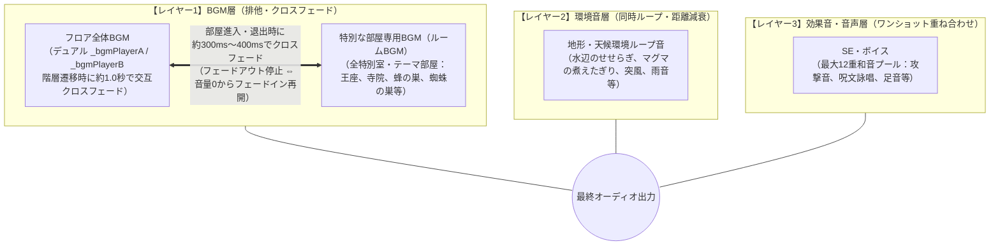

# NetHack 環境音・BGM仕様書 (Ambience Specifications)

本ドキュメントは、NetHack のサウンドサブシステムにおける **環境音・BGM機能（`soundprocs.sound_ambience`）** の仕様、ID体系、イベント種別、推奨音声ファイル名（`.ogg`）、および DartHack（Flutter）移植層での連携設計を整理した仕様書である。

---

## 1. 概要とアーキテクチャ

### 1.1 `sound_ambience` の役割
NetHack 5.0 で導入されたサウンドプロシージャ `sound_ambience` は、単発の効果音（`soundeffect`）とは異なり、ダンジョンの階層、特別な部屋、天候、地形などの**環境音（アンビエンス）およびBGM**を制御するためのインターフェースである。

### 1.2 関数シグネチャ (`sndprocs.h` / `sound.txt`)
```c
void (*sound_ambience)(int32_t ambience_action,
                       int32_t ambienceid,
                       int32_t hero_proximity);
```

| 引数 | 型 | 説明 |
| :--- | :--- | :--- |
| `ambience_action` | `int32_t` (`enum ambience_actions`) | 環境音に対する操作（開始、停止、更新） |
| `ambienceid` | `int32_t` (`enum ambiences`) | 再生対象の環境音・BGM識別ID |
| `hero_proximity` | `int32_t` | 主人公と音源の距離（0ならフロア全体・距離減衰なし、1以上は距離に応じた音量減衰） |

### 1.3 アクション種別 (`enum ambience_actions`)
```c
enum ambience_actions {
    ambience_nothing, /* 0: 操作なし */
    ambience_begin,   /* 1: 環境音の再生開始（通常はループ再生） */
    ambience_end,     /* 2: 環境音の停止（フェードアウト停止） */
    ambience_update   /* 3: 音量・パラメータ更新（主人公の距離変化に伴う更新） */
};
```

### 1.4 サウンド再生レイヤーと同時再生・クロスフェード原則
DartHack では音の役割と演出意図に合わせて、独立した3層の再生レイヤーでミキシングを制御する。



1. **特別な部屋・テーマ部屋（全室ルームBGMクロスフェード）**:
   - 2.3 に記載されたすべての特別な部屋・テーマ部屋（王座の間、寺院、蜂の巣、動物園、蜘蛛の巣窟、氷の部屋など）は、**すべて「部屋専用BGM（ルームBGM）」** として扱う。
   - **進入時**: 現在のフロアBGMを約300ms〜400msでフェードアウト停止し、その部屋専用のBGMをスムーズにフェードイン再生する。
   - **退出時**: ルームBGMを約300ms〜400msでフェードアウト停止し、退避していたフロアBGMを `resume()` に依存せず `play(AssetSource)` で音量ゼロから**安全にフェードイン復帰**する。
   - **メリット**: 「特別な部屋に入った」というゲーム演出が明確になり、フロアBGMとの音の濁りや喧嘩を完全に防止する。
2. **階層遷移クロスフェード（デュアルフロアBGM）**:
   - 階段昇降やワープによるフロア移動時、2系統のフロアBGMプレイヤー（A/B）が約1.0秒（50ms×20ステップ）かけて交互にクロスフェードし、ブツ切れ感のない滑らかな階層遷移を実現する。
3. **地形・天候の環境音（フロアBGMとの同時再生）**:
   - 水辺（`amb_water`）や溶岩（`amb_lava`）、風（`amb_wind`）、雨（`amb_rain`）などの物理的な地形・天候音は、独立した環境音プレイヤー（`_ambiencePlayer`）でループ再生される。
   - フロアBGMやルームBGMを遮ることなく、自然に背景音として同時にミックスされる。
4. **効果音・音声（SEプール最大12多重再生）**:
   - モンスター攻撃、足音、呪文、店主の怒号ボイス（`voice_shk`）などは、最大12チャンネルのSEプールから即座にワンショット再生され、BGMや環境音の上に重ねてクリアに出力される。
   - 全プレイヤーに `audioFocus: none` を適用しているため、効果音再生によってBGMが停止することはない。

---

## 2. 環境音・BGM ID体系と推奨音声ファイル一覧

ファイル命名規則はユーザー方針に基づき、**`amb_<name>.ogg`** に統一する。
再生モードはすべて **ループ再生（Loop = true）** を基本とし、階層移動や部屋退出時にフェードアウト（または即時停止）する。

### 2.1 ダンジョン分岐・特殊階層（フロア全体BGM）
主人公が特定のダンジョン分岐や特殊階層に進入した際に `hero_proximity = 0` でトリガーされる。
NetHack 5.0（`dungeon.lua` / `dungeon.h`）で定義されるすべてのダンジョン分岐および固定特殊階層に対応する。

#### 2.1.1 主要ダンジョン分岐（通常階層BGM）
各ダンジョン分岐の通常フロア探索時に流れるベースBGM。

| ID | 推奨ファイル名 | 日本語イベント説明 | 再生種別 | 音量減衰 |
| :--- | :--- | :--- | :--- | :--- |
| `amb_dungeon` | `amb_dungeon.ogg` | 運命の大迷宮（通常フロア）の環境BGM。暗く湿った地下迷宮の反響音。 | ループ | なし (0) |
| `amb_mines` | `amb_mines.ogg` | ノームの鉱山の環境BGM。ツルハシの遠い打撃音や岩盤の軋み。 | ループ | なし (0) |
| `amb_sokoban` | `amb_sokoban.ogg` | 倉庫番の環境BGM。パズルに集中できる静かで整然とした旋律。 | ループ | なし (0) |
| `amb_quest` | `amb_quest.ogg` | クエスト階層の環境BGM。各職業の試練にふさわしい緊張感ある音楽。 | ループ | なし (0) |
| `amb_gehennom` | `amb_gehennom.ogg` | ゲヘナ（地獄）の環境BGM。低く重苦しい唸り音、業火の気配。 | ループ | なし (0) |
| `amb_vlad` | `amb_vlad.ogg` | ヴラドの塔の環境BGM。ゴシック調の冷徹で不気味な旋律。 | ループ | なし (0) |
| `amb_ludios` | `amb_ludios.ogg` | ルーディオス砦（Fort Ludios）のBGM。金塊と富に満ちた豪華な要塞の音楽。 | ループ | なし (0) |
| `amb_tutorial` | `amb_tutorial.ogg` | チュートリアル階層のBGM。初心者向けの穏やかで教導的な旋律。 | ループ | なし (0) |

#### 2.1.2 運命の大迷宮の特殊階層（メインダンジョン名所BGM）
メインダンジョン内に現れる固定特殊階層。

| ID | 推奨ファイル名 | 日本語イベント説明 | 再生種別 | 音量減衰 |
| :--- | :--- | :--- | :--- | :--- |
| `amb_oracle` | `amb_oracle.ogg` | デルフィの神託所フロア（`oracle`）。全域に漂う神託の静寂と神秘的な気配。 | ループ | なし (0) |
| `amb_rogue` | `amb_rogue.ogg` | ローグ階層（`rogue`）。初代Rogueを彷彿とさせるレトロな8bitチップチューン調の旋律。 | ループ | なし (0) |
| `amb_bigroom` | `amb_bigroom.ogg` | 大部屋階層（`bigrm`）。見渡す限りの広大な空間に反響する不穏な風音。 | ループ | なし (0) |
| `amb_medusa` | `amb_medusa.ogg` | メデューサの島（`medusa`）。水に閉ざされた孤島、石化の恐怖を煽る緊迫した旋律。 | ループ | なし (0) |
| `amb_castle` | `amb_castle.ogg` | 城・要塞（`castle` / Stronghold）。跳ね橋、堀、ドラゴンの護衛が待ち受ける壮大かつ重厚な城塞BGM。 | ループ | なし (0) |

#### 2.1.3 各分岐ダンジョンの特殊階層
鉱山、倉庫番、クエストなどの分岐内に存在する重要フロア。

| ID | 推奨ファイル名 | 日本語イベント説明 | 再生種別 | 音量減衰 |
| :--- | :--- | :--- | :--- | :--- |
| `amb_town` | `amb_town.ogg` | ミナタウン（鉱山町 / `minetn`）。活気のある市場、寺院、居住区の喧騒。 | ループ | なし (0) |
| `amb_minend` | `amb_minend.ogg` | 鉱山最下層（`minend`）。鉱脈の最深部、眩い宝石の輝きと危険なモンスターの気配。 | ループ | なし (0) |
| `amb_sokoend` | `amb_sokoend.ogg` | 倉庫番最上階（`soko4`）。難関パズルを突破した達成感と賞品部屋の清々しい旋律。 | ループ | なし (0) |
| `amb_quest_nemesis` | `amb_quest_nemesis.ogg` | クエスト宿敵の階層（`x-goal`）。アーティファクトを奪還するためのボス決戦BGM。 | ループ | なし (0) |

#### 2.1.4 ゲヘナ・悪魔階層（地獄の深淵BGM）
ゲヘナ深層に座すデーモン・ロード、プリンス、イェンダーの魔法使いの居城。

| ID | 推奨ファイル名 | 日本語イベント説明 | 再生種別 | 音量減衰 |
| :--- | :--- | :--- | :--- | :--- |
| `amb_valley` | `amb_valley.ogg` | 死の谷（`valley`）。ゲヘナの入口に広がるアンデッドの墓場。荒涼とした絶望の旋律。 | ループ | なし (0) |
| `amb_juiblex` | `amb_juiblex.ogg` | ジュピレクスの沼地（`juiblex`）。毒泥とスライムに覆われた腐敗と溶解の不気味な旋律。 | ループ | なし (0) |
| `amb_baalzebub` | `amb_baalzebub.ogg` | ベルゼブブの住居（`baalz`）。蝿の王が支配する沼と不快な羽音の混じる悪魔的音楽。 | ループ | なし (0) |
| `amb_asmodeus` | `amb_asmodeus.ogg` | アスモデウスの宮殿（`asmodeus`）。地獄の高位貴族にふさわしい威厳と邪悪に満ちた旋律。 | ループ | なし (0) |
| `amb_orcus` | `amb_orcus.ogg` | オルクスの町（`orcus`）。死霊の王オルクスが支配する廃墟の町。 | ループ | なし (0) |
| `amb_wizard_tower` | `amb_wizard_tower.ogg` | イェンダーの魔法使いの塔（`wizard1`〜`wizard3`）。神秘的かつ狂気じみた実験棟の旋律。 | ループ | なし (0) |
| `amb_fakewiz` | `amb_fakewiz.ogg` | 偽の魔法使いの塔（`fakewiz1`, `fakewiz2`）。本物と酷似しつつも何かが欠落した不穏な音楽。 | ループ | なし (0) |
| `amb_sanctum` | `amb_sanctum.ogg` | モロクの聖所（`sanctum`）。モロクの高司祭が魔除けを守る最深聖域。冒涜的かつ荘厳な大聖堂の旋律。 | ループ | なし (0) |

#### 2.1.5 精霊界・エンドゲーム
地上への帰還後に突入する四元素の精霊界およびアストラル界。

| ID | 推奨ファイル名 | 日本語イベント説明 | 再生種別 | 音量減衰 |
| :--- | :--- | :--- | :--- | :--- |
| `amb_plane_earth` | `amb_plane_earth.ogg` | 土の精霊界（`earth`）。迷路のような固い岩盤を掘り進む重低音の響き。 | ループ | なし (0) |
| `amb_plane_air` | `amb_plane_air.ogg` | 風の精霊界（`air`）。吹きすさぶ暴風と雷雲が渦巻く疾風の音楽。 | ループ | なし (0) |
| `amb_plane_fire` | `amb_plane_fire.ogg` | 火の精霊界（`fire`）。煮えたぎる灼熱の業火と紅蓮の旋律。 | ループ | なし (0) |
| `amb_plane_water` | `amb_plane_water.ogg` | 水の精霊界（`water`）。漂う気泡と水中を彷徨う深海のような幻想的BGM。 | ループ | なし (0) |
| `amb_astral` | `amb_astral.ogg` | アストラル界（`astral`）。3つの祭壇と黙示録の騎士たちが待ち受ける神聖かつ超越的な最終決戦BGM。 | ループ | なし (0) |

#### 2.1.6 システム・ゲーム進行
ゲームの開始、昇天、死亡時に流れる特殊BGM。

| ID | 推奨ファイル名 | 日本語イベント説明 | 再生種別 | 音量減衰 |
| :--- | :--- | :--- | :--- | :--- |
| `amb_title` | `amb_title.ogg` | タイトル画面BGM。冒険の旅立ちを予感させるオープニングテーマ。 | ループ | なし (0) |
| `amb_gameover` | `amb_gameover.ogg` | ゲームオーバー・昇天BGM。戦いを終えた冒険者に捧げる鎮魂曲（または勝利の讃歌）。 | ループ | なし (0) |

---

### 2.2 自然・地形・天候環境音（フロアBGMと同時再生 / 距離減衰あり）
フロア内の特定地形（水、溶岩、吹き抜ける風）や天候効果に伴う環境音。フロアBGMに重ねて再生される。

| ID | 推奨ファイル名 | 日本語イベント説明 | 再生種別 | 音量減衰 |
| :--- | :--- | :--- | :--- | :--- |
| `amb_water` | `amb_water.ogg` | 水辺・噴水の環境音。水が湧き出る音、せせらぎ。 | ループ (環境音 / 同時再生) | 距離依存 |
| `amb_lava` | `amb_lava.ogg` | 溶岩地帯・火の精霊界の環境音。マグマの煮えたぎるボコボコという音。 | ループ (環境音 / 同時再生) | 距離依存 |
| `amb_wind` | `amb_wind.ogg` | 風の精霊界・吹き抜け通路の環境音。吹きすさぶ突風の轟音。 | ループ (環境音 / 同時再生) | なし (0) |
| `amb_rain` | `amb_rain.ogg` | 雨天・天井からの水滴の環境音。絶え間ない滴りと湿気。 | ループ (環境音 / 同時再生) | なし (0) |
| `amb_swamp` | `amb_swamp.ogg` | 沼地・ジュピレクス階層の環境音。腐敗した泥の気泡音、毒気の泡立ち。 | ループ (環境音 / 同時再生) | 距離依存 |

---

### 2.3 特別な部屋・施設（部屋進入時 / ルームBGMクロスフェード）
主人公がダンジョン内の特別な部屋に進入した際にトリガーされ、**フロアBGMと短時間（約300ms〜400ms）でクロスフェードして切り替わる**。
部屋を出ると、フロアBGMが一時停止位置からシームレスにフェードイン復帰する。

#### 2.3.1 伝統的な特別室・施設・モンスターの巣（Cコア標準）
C コアの部屋タイプ（`rtype`）やモンスター生成関数に基づき判定される特別な部屋・施設。

| ID | 推奨ファイル名 | 日本語イベント説明 | 再生種別・動作 | 音量減衰 |
| :--- | :--- | :--- | :--- | :--- |
| `amb_in_a_shop` | `amb_in_a_shop.ogg` | 店内の音楽。店主の気配、小銭の触れ合う音、陳列棚のざわめき。 | ループ (ルームBGM / クロスフェード) | なし (部屋内均一) |
| `amb_inside_temple` | `amb_inside_temple.ogg` | 寺院内の音楽。荘厳なチャント（聖歌）、パイプオルガンの残響、鈴の音。 | ループ (ルームBGM / クロスフェード) | なし (部屋内均一) |
| `amb_inside_vault` | `amb_inside_vault.ogg` | 金庫室の音楽・環境音。密閉された石壁の完全な静寂と金貨の山。 | ループ (ルームBGM / クロスフェード) | なし (部屋内均一) |
| `amb_approaching_oracle` | `amb_approaching_oracle.ogg` | デルフィの神託所。瞑想を誘う神秘的な波動、澄んだチャイム音。 | ループ (ルームBGM / クロスフェード) | なし (部屋内均一) |
| `amb_in_a_court` | `amb_in_a_court.ogg` | 王座の間（宮廷）。優雅な宮廷音楽、トランペットのファンファーレ、貴族のざわめき。 | ループ (ルームBGM / クロスフェード) | なし (部屋内均一) |
| `amb_in_a_barracks` | `amb_in_a_barracks.ogg` | 兵舎の音楽。兵士たちの軍靴の行進音、武器や鎧の擦れる音。 | ループ (ルームBGM / クロスフェード) | なし (部屋内均一) |
| `amb_in_a_zoo` | `amb_in_a_zoo.ogg` | 動物園（モンスター部屋）。様々な野獣の唸り声、咆哮、檻の軋み。 | ループ (ルームBGM / クロスフェード) | なし (部屋内均一) |
| `amb_in_a_beehive` | `amb_in_a_beehive.ogg` | 蜂の巣の部屋。無数の巨大蜂が飛び交うブーンという不穏な羽音の調べ。 | ループ (ルームBGM / クロスフェード) | なし (部屋内均一) |
| `amb_inside_anthole` | `amb_inside_anthole.ogg` | 蟻塚の部屋。無数の巨大蟻が壁を這い回るカサカサという足音の調べ。 | ループ (ルームBGM / クロスフェード) | なし (部屋内均一) |
| `amb_inside_leprehall` | `amb_inside_leprehall.ogg` | レプラコーンの広間。陽気で小気味よいアイリッシュジグ、硬貨を数える音、いたずらっぽい忍び笑い。 | ループ (ルームBGM / クロスフェード) | なし (部屋内均一) |
| `amb_in_a_morgue` | `amb_in_a_morgue.ogg` | 死体置き場。冷え切った空気、腐臭、死霊の囁き、石棺のきしみ。 | ループ (ルームBGM / クロスフェード) | なし (部屋内均一) |
| `amb_in_cemetery` | `amb_in_cemetery.ogg` | 墓地（死者の部屋）。夜風のうめき声、墓石の陰から聞こえる微かな怨嗟。 | ループ (ルームBGM / クロスフェード) | なし (部屋内均一) |
| `amb_in_a_cockatrice_nest` | `amb_in_a_cockatrice_nest.ogg` | コカトリスの巣。石化の気配、乾燥した鱗の擦れる不気味な旋律。 | ループ (ルームBGM / クロスフェード) | なし (部屋内均一) |
| `amb_in_a_lemure_pit` | `amb_in_a_lemure_pit.ogg` | レムレースの穴。地獄の亡者たちの絶え間ない苦痛の呻きと叫びの旋律。 | ループ (ルームBGM / クロスフェード) | なし (部屋内均一) |
| `amb_in_a_migot_nest` | `amb_in_a_migot_nest.ogg` | ミ＝ゴの巣。異形の羽音、理解不能な宇宙的テレパシーノイズ。 | ループ (ルームBGM / クロスフェード) | なし (部屋内均一) |
| `amb_in_a_black_market` | `amb_in_a_black_market.ogg` | 闇市の音楽。怪しげな密売人たちの囁き、違法取引の喧騒。 | ループ (ルームBGM / クロスフェード) | なし (部屋内均一) |
| `amb_in_swamp_room` | `amb_in_swamp_room.ogg` | 沼地部屋の音楽。淀んだ泥水のぬかるみ、不穏な泡立ちと湿地帯の気配。 | ループ (ルームBGM / クロスフェード) | なし (部屋内均一) |

#### 2.3.2 NetHack 5.0 テーマ部屋（`themerms.lua`）
NetHack 5.0 で追加されたテーマ部屋（Themed Rooms）。部屋進入時にフロアBGMとクロスフェードして専用BGMを再生する。

| ID | 推奨ファイル名 | 日本語イベント説明 | 再生種別・動作 | 音量減衰 |
| :--- | :--- | :--- | :--- | :--- |
| `amb_theme_nymph_garden` | `amb_theme_nymph_garden.ogg` | ニンフの園（Garden）。魅惑的で穏やかな竪琴の調べ、妖精の寝息やささやき、噴水のせせらぎ。 | ループ (ルームBGM / クロスフェード) | なし (部屋内均一) |
| `amb_theme_spider_nest` | `amb_theme_spider_nest.ogg` | 蜘蛛の巣窟（Spider nest）。無数の蜘蛛が糸を張り巡らせる音、壁を這い回る不気味なカサカサ音。 | ループ (ルームBGM / クロスフェード) | なし (部屋内均一) |
| `amb_theme_ice_room` | `amb_theme_ice_room.ogg` | 氷の部屋（Ice room）。凍てつく寒風の吹きすさぶ音、氷が軋んで割れる音、冷気の残響。 | ループ (ルームBGM / クロスフェード) | なし (部屋内均一) |
| `amb_theme_cloud_room` | `amb_theme_cloud_room.ogg` | 雲・霧の部屋（Cloud room）。濃霧が立ち込める深い静寂、シューと噴き出す蒸気やガス雲の音。 | ループ (ルームBGM / クロスフェード) | なし (部屋内均一) |
| `amb_theme_boulder_room` | `amb_theme_boulder_room.ogg` | 巨石の部屋（Boulder room）。ゴロゴロと重く転がる巨大岩の地響き、落石の軋み。 | ループ (ルームBGM / クロスフェード) | なし (部屋内均一) |
| `amb_theme_trap_room` | `amb_theme_trap_room.ogg` | トラップ部屋（Trap room）。カチリと作動する微かな機械歯車の回転音、張り詰めた緊張感。 | ループ (ルームBGM / クロスフェード) | なし (部屋内均一) |
| `amb_theme_buried_treasure` | `amb_theme_buried_treasure.ogg` | 埋没財宝の部屋（Buried treasure）。地下深くから漂う金属的な金貨の共鳴、宝箱の鍵が軋む微かな音。 | ループ (ルームBGM / クロスフェード) | なし (部屋内均一) |
| `amb_theme_buried_zombies` | `amb_theme_buried_zombies.ogg` | 蠢く土葬室（Buried zombies）。土中から聞こえる爪で土を掻き分ける音、蘇生しつつある死者の呻き。 | ループ (ルームBGM / クロスフェード) | なし (部屋内均一) |
| `amb_theme_massacre` | `amb_theme_massacre.ogg` | 大虐殺跡（Massacre）。血生臭い風音、死霊たちの無念の怨嗟、飛び交うハエの羽音。 | ループ (ルームBGM / クロスフェード) | なし (部屋内均一) |
| `amb_theme_statuary` | `amb_theme_statuary.ogg` | 彫像展示室（Statuary）。冷徹な石像が並ぶ静けさ、時折石像が視線を向けたかのような石の擦れる音。 | ループ (ルームBGM / クロスフェード) | なし (部屋内均一) |
| `amb_theme_light_source` | `amb_theme_light_source.ogg` | 暗闇の灯火（Light source）。パチパチと静かに爆ぜる油灯の炎の音、温かな光の気配。 | ループ (ルームBGM / クロスフェード) | なし (部屋内均一) |
| `amb_theme_temple_of_the_gods` | `amb_theme_temple_of_the_gods.ogg` | 三神の合祀殿（Temple of the gods）。秩序・中立・混沌の相反する聖歌や詠唱が重なり合う神聖かつ不穏な響き。 | ループ (ルームBGM / クロスフェード) | なし (部屋内均一) |
| `amb_theme_ghost_adventurer` | `amb_theme_ghost_adventurer.ogg` | 冒険者の亡霊（Ghost of an Adventurer）。かつての冒険者の悲哀に満ちたため息、金属鎧の揺れる音。 | ループ (ルームBGM / クロスフェード) | なし (部屋内均一) |
| `amb_theme_storeroom` | `amb_theme_storeroom.ogg` | 物置部屋・ミミックの罠（Storeroom）。無数の木箱の匂い、ミミックが蠢くわずかなネバネバした擬態音。 | ループ (ルームBGM / クロスフェード) | なし (部屋内均一) |
| `amb_theme_teleport_hub` | `amb_theme_teleport_hub.ogg` | テレポート中枢室（Teleportation hub）。空間の歪みが生み出す電子音のようなハム音、次元のさざ波。 | ループ (ルームBGM / クロスフェード) | なし (部屋内均一) |
| `amb_theme_mausoleum` | `amb_theme_mausoleum.ogg` | 霊廟（Mausoleum）。重い石棺の隙間から漏れる冷たい隙間風、アンデッドの不穏な気配。 | ループ (ルームBGM / クロスフェード) | なし (部屋内均一) |
| `amb_theme_pillars` | `amb_theme_pillars.ogg` | 列柱の間（Pillars）。整然と立ち並ぶ巨大な柱の陰から反響する足音、厳粛な回廊の響き。 | ループ (ルームBGM / クロスフェード) | なし (部屋内均一) |
| `amb_theme_fake_delphi` | `amb_theme_fake_delphi.ogg` | 偽神託所（Fake Delphi）。不自然に静まり返った室内、神託所のものとは微かに異なる歪んだチャイム音。 | ループ (ルームBGM / クロスフェード) | なし (部屋内均一) |

---

## 3. Cコアからのトリガー契機と実装推奨箇所

NetHack 5.0 の C コアでは `sound_ambience` を呼び出すマクロ `SoundAmbience` が定義可能であり、DartHack では以下のライフサイクルでフックすることを推奨する。

### 3.1 階層遷移（ダンジョンBGM）
- **呼出箇所**: `src/dungeon.c` の `goto_level()` または `src/do.c` の階段昇降時
- **契機**: 新しいフロアへ進入完了した直後
- **階層判定とBGM解決ロジック例**:
  C コアの `dungeon.h` に定義された特殊階層マクロ（`Is_...`）およびダンジョン分岐判定マクロ（`In_...`）を用いて、現在の階層（`u.uz`）に対応するBGM IDを動的に解決する。
  ```c
  int get_dungeon_ambience(void)
  {
      /* 1. エンドゲーム（精霊界・アストラル界） */
      if (In_endgame(&u.uz)) {
          if (Is_astralevel(&u.uz)) return amb_astral;
          if (Is_waterlevel(&u.uz)) return amb_plane_water;
          if (Is_firelevel(&u.uz))  return amb_plane_fire;
          if (Is_airlevel(&u.uz))   return amb_plane_air;
          if (Is_earthlevel(&u.uz)) return amb_plane_earth;
      }

      /* 2. ゲヘナ内の特殊階層 */
      if (In_hell(&u.uz)) {
          if (Is_sanctum(&u.uz))        return amb_sanctum;
          if (Is_wiz1_level(&u.uz) ||
              Is_wiz2_level(&u.uz) ||
              Is_wiz3_level(&u.uz))     return amb_wizard_tower;
          if (Is_juiblex_level(&u.uz))   return amb_juiblex;
          if (Is_asmo_level(&u.uz))     return amb_asmodeus;
          if (Is_baal_level(&u.uz))     return amb_baalzebub;
          if (Is_valley(&u.uz))         return amb_valley;
          if (In_V_tower(&u.uz))        return amb_vlad;
          return amb_gehennom;
      }

      /* 3. クエスト */
      if (In_quest(&u.uz)) {
          if (Is_nemesis(&u.uz))        return amb_quest_nemesis;
          return amb_quest;
      }

      /* 4. ノームの鉱山 */
      if (In_mines(&u.uz)) {
          if (Is_mineend_level(&u.uz))  return amb_minend;
          if (in_town(u.ux, u.uy))       return amb_town;
          return amb_mines;
      }

      /* 5. 倉庫番 */
      if (In_sokoban(&u.uz)) {
          if (Is_sokoend_level(&u.uz))  return amb_sokoend;
          return amb_sokoban;
      }

      /* 6. ルーディオス砦 */
      if (Is_knox(&u.uz))               return amb_ludios;

      /* 7. 運命の大迷宮内の固定特殊階層 */
      if (Is_stronghold(&u.uz))         return amb_castle;
      if (Is_medusa_level(&u.uz))       return amb_medusa;
      if (Is_bigroom(&u.uz))            return amb_bigroom;
      if (Is_rogue_level(&u.uz))        return amb_rogue;
      if (Is_oracle_level(&u.uz))       return amb_oracle;

      /* 8. 運命の大迷宮（通常階層） */
      return amb_dungeon;
  }
  ```
- **呼出処理**:
  ```c
  int new_ambience = get_dungeon_ambience();
  if (new_ambience != prev_dungeon_ambience) {
      /* 直前の階層BGMを終了 */
      SoundAmbience(ambience_end, prev_dungeon_ambience, 0);
      /* 新しい階層BGMを開始 */
      SoundAmbience(ambience_begin, new_ambience, 0);
      prev_dungeon_ambience = new_ambience;
  }
  ```

### 3.2 部屋への進入・退出（施設環境音）
- **呼出箇所**: `src/sounds.c` の `dosounds()`、`src/shk.c` の `check_room()`、`src/priest.c`
- **契機**: 主人公が部屋の内外を移動したとき（`u.urooms[0]` の変化検知）
- **処理**:
  ```c
  /* 店に入った場合 */
  SoundAmbience(ambience_begin, amb_in_a_shop, 0);
  /* 店を出た場合 */
  SoundAmbience(ambience_end, amb_in_a_shop, 0);
  ```

### 3.3 音源との距離更新（近接環境音）
- **呼出箇所**: `src/monmove.c`、`src/fountain.c`、ターン経過処理（`moveloop`）
- **契機**: 毎ターンの移動後、音源（噴水、溶岩、蜂の巣など）とのチェビシェフ距離を計算
- **処理**:
  ```c
  int dist = distmin(u.ux, u.uy, source_x, source_y);
  if (dist < MAX_HEARING_DISTANCE) {
      SoundAmbience(ambience_update, amb_water, dist);
  } else {
      SoundAmbience(ambience_end, amb_water, 0);
  }
  ```

### 3.4 テーマ部屋進入時のトリガー契機（Lua・Cコア連携）
- **呼出箇所**: `src/hack.c` の `check_special_room()` または部屋進入時の Lua フック
- **契機**: 主人公が `THEMEROOM` 属性の部屋に進入したとき
- **処理**:
  NetHack 5.0 ではテーマ部屋生成時に `struct mkroom` にテーマ名または固有識別子が保持されるか、Lua スクリプト側で進入イベントを購読できる。
  ```c
  /* テーマ部屋進入時（例: ニンフの園） */
  SoundAmbience(ambience_begin, amb_theme_nymph_garden, 0);
  /* テーマ部屋退出時 */
  SoundAmbience(ambience_end, amb_theme_nymph_garden, 0);
  ```

---

## 4. Flutter側（DartHack）連携設計

### 4.1 FFI コールバックと SoundManager への伝達
1. **C移植層 (`winflutter.c`)**:
   - `ambienceid` の種別を判定し、フロアBGM（2.1）および特別な部屋・テーマ部屋（2.3）はすべて **`SOUND_CAT_BGM`**、自然・地形・天候（2.2）のみを **`SOUND_CAT_AMBIENCE`** としてディスパッチする。
   ```c
   void flutter_sound_ambience(int32_t action, int32_t amb_id, int32_t proximity) {
       if (g_flutter_cbs.sound_ambience_cb) {
           g_flutter_cbs.sound_ambience_cb(action, amb_id, proximity);
       }
   }
   ```
2. **Dart側 (`SoundManager`) の役割分担**:
   - `_bgmPlayerA` / `_bgmPlayerB`: デュアルフロアBGMプレイヤー（ループ再生）。A/B交互に約1.0秒（50ms×20ステップ）かけて滑らかに音量をクロスフェード。
   - `_roomBgmPlayer`: 特別な部屋専用BGM（ルームBGM、ループ再生）。独立プレイヤーにより中断・再開とファイル欠落時のフォールバックを実現。
   - `_ambiencePlayer`: 地形・天候環境音（水、溶岩、風、雨等）の同時ループ再生プレイヤー。
   - `_pool`: 効果音（SE）・音声（ボイス）用の最大12音独立プレイヤープール（`audioFocus: none` によりBGMと完全並行ミックス）。

### 4.2 フロアBGMとルームBGMの短時間クロスフェード制御設計
すべての特別な部屋・テーマ部屋（王座の間、寺院、蜂の巣、動物園、蜘蛛の巣窟等）への進入・退出時は、以下のアルゴリズムで短時間クロスフェードを行う。

1. **進入時（`ambience_begin` 受信）**:
   - 現在再生中のフロアBGMを記憶（`_currentFloorBgm`）。
   - 約300ms〜400ms（ステップ約50ms×6段階）でフロアBGMの音量をゼロへフェードアウトして停止。
   - ルームBGMのソースをロードし、音量ゼロから300ms〜400msで目標音量へ**フェードイン再生**。
2. **退出時（`ambience_end` 受信）**:
   - ルームBGMを約300ms〜400msでフェードアウトして停止。
   - 退避していたフロアBGM（`_currentFloorBgm`）が存在する場合、`resume()` は使用せず、`play(AssetSource('sounds/$_currentFloorBgm'))` を呼び出し、音量ゼロから300ms〜400msで元の音量へ**安全にフェードイン復帰**。

### 4.3 タイトルBGM自動再生とゲーム本編開始保留機構
1. **アプリ起動時**:
   - `SoundManager.initialize()` 完了時点でゲーム未開始であれば、自動的に `amb_title.ogg` を即時再生。
2. **セーブデータ選択・キャラメイク中**:
   - Cコア初期化に伴い `amb_dungeon.ogg` などのフロアBGMイベントが届いても即時再生せず、保留変数（`_pendingFloorBgm`）に一時退避してタイトルBGMを継続。
3. **ゲーム本編開始（マップ画面初回表示）**:
   - `notifyMainGameStarted()` が呼び出された瞬間に、タイトルBGMから保留されていたフロアBGMへの約1.0秒クロスフェードを開始。

### 4.4 地形・天候環境音とSEの同時ミキシング設計
水音、マグマ音、突風、雨音などの環境音は、フロアBGMやルームBGMの再生状態に影響を与えず、以下の仕様で常時並行ミックスされる。

1. **距離減衰（`proximity`）のリアルタイム反映**:
   - 音源とのチェビシェフ距離に応じて `setVolume()` を動的にスケール（減衰）。
2. **完全ミキシング AudioContext（`audioFocus: none`）**:
   - 全プレイヤーに `AndroidAudioFocus.none` / iOS `ambient` を二重適用しているため、SE 再生や外部音楽アプリ再生によって BGM や環境音が遮断・停止されることは一切ない。

### 4.5 安全装置とUX原則
- 対応する `.ogg` ファイルが存在しない場合は、エラーログを出力せず単に再生をスキップする。
- プレイヤーの歩行・ターン進行中に音声再生の完了を `await` で待機することは絶対にせず、すべて非同期（`unawaited`）で処理して快適なUXを維持する。

---

## 5. 仕様書一覧・相互参照

- [sound_macros_list.md](sound_macros_list.md): 全316音マスター管理表 & Cコア内全376箇所呼び出し対照表
- [combat_sound_specification.md](combat_sound_specification.md): 戦闘アクション効果音（33種）詳細仕様書
- [sound_system_design.md](sound_system_design.md): NetHackサウンド機構とDartHack音響システム設計・確定実装仕様書
- [voice_speech_specs.md](voice_speech_specs.md): 声音・神託・TTS発話詳細仕様書

