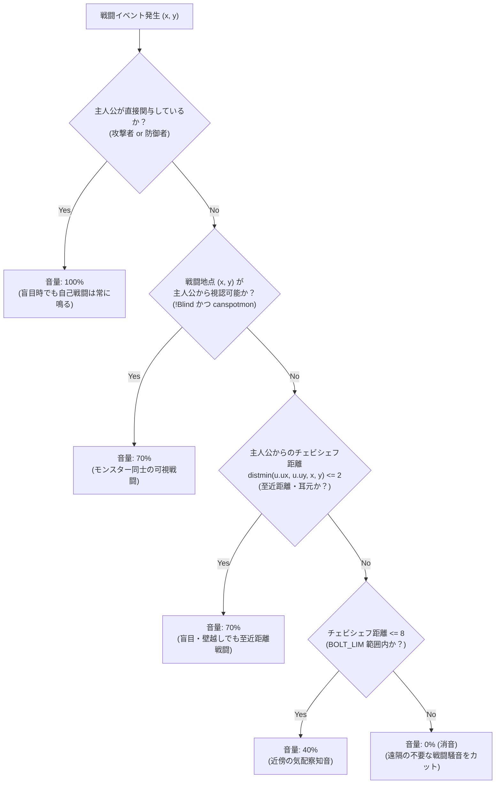
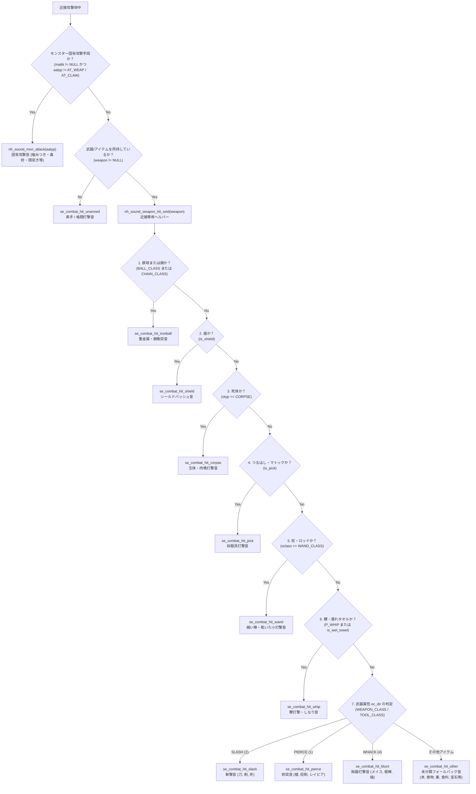
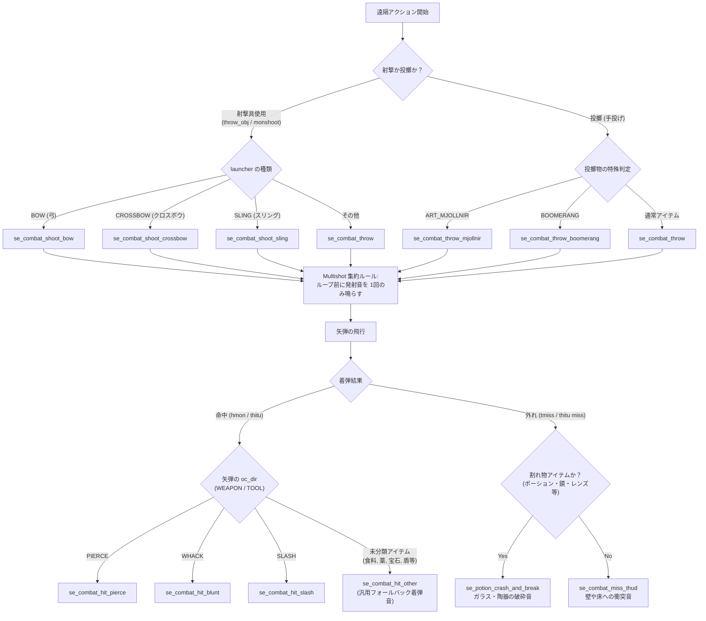

# 戦闘アクション効果音 仕様書 (Combat Sound Specification)

本書は、DartHack / NetHack における戦闘アクション効果音（近接攻撃、空振り、遠隔射撃、投擲、着弾、外れ、呪文詠唱、杖発動、モンスター固有攻撃手段12種、特徴的アイテム攻撃音および未分類フォールバック音など計33種）のシステム設計、判定ロジック、トリガー配置、および音響素材仕様を定めた専用仕様書です。

全体効果音一覧については [sound_macros_list.md](sound_macros_list.md) を、音響システム全体の設計については [sound_system_design.md](sound_system_design.md) を併せて参照してください。

---

## 1. システム概要と設計方針

### 1.1 導入の目的
NetHack のテキスト中心の戦闘ログ（「〜を攻撃した」「〜はかわした」など）に対し、リアルタイムな打撃音、風切り音、発射音、着弾音、モンスター特有の生体攻撃音を付与することで、臨場感と戦況把握性を大幅に向上させます。

### 1.2 5大設計原則
1. **日英二重コア（`c_core/nethack_jp` / `c_core/nethack_en`）の完全同期**:
   すべてのサウンドマクロ定義（`seffects.h`）、プロトタイプ宣言（`extern.h`）、共通ヘルパー実装（`sounds.c`）、および戦闘処理フック（`uhitm.c`, `mhitu.c`, `mhitm.c` 等）を日英両コアでバイト単位・同一挙動で同期。
2. **盲目セーフ & 不可視気配察知（40%音量）**:
   主人公が盲目状態であっても主人公自身の戦闘音は常に 100% で再生。壁の向こうや不可視モンスター同士の戦闘は、主人公から 8マス以内（`BOLT_LIM`）に限り 40% の控えめな音量で鳴らすことで「近隣の気配」を察知させ、遠方の騒音化を防止。
3. **生データ属性に基づく自動判定**:
   武器種別判定には NetHack オブジェクト定義の `objects[otyp].oc_dir`（`SLASH`, `WHACK`, `PIERCE`）を活用。さらに鉄球・盾・死体・つるはし・杖などの特徴的アイテムや素手攻撃、モンスター攻撃手段（`AT_CLAW` 〜 `AT_GULP` の 12種）も自動判定。未分類アイテムは汎用音へフォールバック。
4. **多段攻撃（Multishot）の発射音集約**:
   弓矢やスリング等の多段射撃において、矢の数だけ発射音が連続爆音化するのを防ぐため、発射音はループ前の「射撃アクション開始時」に 1回のみ鳴らし、着弾音・外れ音は飛翔体ごとに個別再生。
5. **Flutter 層におけるデバウンス制御（60ms）**:
   連続攻撃や複数モンスターの同一フレーム交戦時に同一SEが多重再生されてクリッピングや音割れを起こすのを防ぐため、同一サウンドIDに対して 60ms の最小発声間隔（クールダウン）を適用。
6. **プレイヤープール（最大12音同時再生）と重要音プリエンプション**:
   最大同時12音の循環プレイヤープールおよび同一音最大3インスタンス制限により、激しい乱戦時でも歪みのない音響を実現。プール満杯時に重要アラームや呪文詠唱・実績音が要求された場合は、再生中の通常戦闘打撃音を安全にフェード停止して割り込み再生（プリエンプト）。

---

## 2. 戦闘効果音 一覧（全33種 / sound_macros_list.md No.204〜236）

| No | サウンドID | マクロ名 | 日本語名 | 音のイメージ・概要 | トリガーC関数 (ファイル) | 推奨長さ |
|:---:|:---|:---|:---|:---|:---|:---:|
| 204 | `combat_hit_slash` | `se_combat_hit_slash` | 近接攻撃ヒット（斬撃） | 鋭い刃物で切り裂く音（刀、剣、斧） | `nh_sound_melee_hit` (`uhitm.c`, `mhitu.c`, `mhitm.c`) | 0.2〜0.4秒 |
| 205 | `combat_hit_blunt` | `se_combat_hit_blunt` | 近接攻撃ヒット（打撃） | 重い鈍器で叩き潰す鈍い衝撃音（メイス、棍棒、槌） | `nh_sound_melee_hit` (`uhitm.c`, `mhitu.c`, `mhitm.c`) | 0.2〜0.4秒 |
| 206 | `combat_hit_pierce` | `se_combat_hit_pierce` | 近接攻撃ヒット（刺突） | 鋭利な切先が突き刺さる音（槍、短剣、レイピア） | `nh_sound_melee_hit` (`uhitm.c`, `mhitu.c`, `mhitm.c`) | 0.2〜0.4秒 |
| 207 | `combat_hit_unarmed` | `se_combat_hit_unarmed` | 近接攻撃ヒット（素手/格闘） | 肉体同士が衝突する打撃音（パンチ、キック） | `nh_sound_melee_hit` (`uhitm.c`, `mhitu.c`, `mhitm.c`) | 0.15〜0.3秒 |
| 208 | `combat_hit_whip` | `se_combat_hit_whip` | 近接攻撃ヒット（鞭/しなり） | 鞭やタオル特有の鋭いしなり・打撃音（牛追い鞭、ゴムホース、濡れたタオル） | `nh_sound_melee_hit` (`uhitm.c`, `mhitu.c`, `mhitm.c`) | 0.2〜0.4秒 |
| 209 | `combat_hit_ironball` | `se_combat_hit_ironball` | 近接攻撃ヒット（鉄球/鎖） | 重金属の重厚な打撃音と鎖の擦れ音（重い鉄球、鉄の鎖） | `nh_sound_melee_hit` (`uhitm.c`, `mhitu.c`, `mhitm.c`) | 0.2〜0.4秒 |
| 210 | `combat_hit_shield` | `se_combat_hit_shield` | 近接攻撃ヒット（盾バッシュ） | 盾による重い防具シールドバッシュ音（近接限定、各種の盾） | `nh_sound_melee_hit` (`uhitm.c`, `mhitu.c`, `mhitm.c`) | 0.2〜0.4秒 |
| 211 | `combat_hit_corpse` | `se_combat_hit_corpse` | 近接攻撃ヒット（死体/肉塊） | 死体や肉塊武器による生々しい生体打撃音（死体） | `nh_sound_melee_hit` (`uhitm.c`, `mhitu.c`, `mhitm.c`) | 0.2〜0.35秒 |
| 212 | `combat_hit_pick` | `se_combat_hit_pick` | 近接攻撃ヒット（採掘具） | つるはしやマトックによる硬質な採掘具打撃音（つるはし、ドワーフのマトック） | `nh_sound_melee_hit` (`uhitm.c`, `mhitu.c`, `mhitm.c`) | 0.2〜0.4秒 |
| 213 | `combat_hit_wand` | `se_combat_hit_wand` | 近接攻撃ヒット（杖/ロッド） | 杖やロッドによる硬く乾いた小打撃音（各種の杖・物理打撃） | `nh_sound_melee_hit` (`uhitm.c`, `mhitu.c`, `mhitm.c`) | 0.15〜0.3秒 |
| 214 | `combat_hit_other` | `se_combat_hit_other` | 近接/投擲ヒット（その他/汎用） | 未分類アイテム（本・巻物・薬・食料・宝石等）全般の汎用フォールバック打撃音 | `nh_sound_melee_hit`, `nh_sound_missile_hit` | 0.15〜0.3秒 |
| 215 | `combat_miss` | `se_combat_miss` | 近接攻撃空振り | 武器や拳が空を切る風切り音（ヒュッ） | `nh_sound_melee_miss` (`uhitm.c`, `mhitu.c`, `mhitm.c`) | 0.2〜0.3秒 |
| 216 | `combat_shoot_bow` | `se_combat_shoot_bow` | 弓発射 | 弦が弾かれ矢が放たれる音（ビュン） | `nh_sound_shoot` (`dothrow.c`, `mthrowu.c`) | 0.2〜0.4秒 |
| 217 | `combat_shoot_crossbow` | `se_combat_shoot_crossbow` | クロスボウ発射 | 機械式トリガー解放とボルト射出音（カシュッ） | `nh_sound_shoot` (`dothrow.c`, `mthrowu.c`) | 0.2〜0.35秒 |
| 218 | `combat_shoot_sling` | `se_combat_shoot_sling` | スリング発射 | 革紐が風を切り弾丸が飛び出す音（ヒュルッ） | `nh_sound_shoot` (`dothrow.c`, `mthrowu.c`) | 0.2〜0.35秒 |
| 219 | `combat_throw` | `se_combat_throw` | 一般投擲 | 手から投擲物が投げ放たれる音（サッ、ビュッ） | `nh_sound_throw` (`dothrow.c`, `mthrowu.c`) | 0.2〜0.3秒 |
| 220 | `combat_throw_boomerang` | `se_combat_throw_boomerang` | ブーメラン投擲 | 特有の風切り回転音（ヒュンヒュン） | `nh_sound_throw` (`dothrow.c`, `mthrowu.c`) | 0.3〜0.5秒 |
| 221 | `combat_throw_mjollnir` | `se_combat_throw_mjollnir` | ミョルニル投擲 | 雷鳴を帯びた神聖な投擲音（ドシュッ＋放電） | `nh_sound_throw` (`dothrow.c`, `mthrowu.c`) | 0.3〜0.6秒 |
| 222 | `combat_miss_thud` | `se_combat_miss_thud` | 矢弾・投擲外れ（衝突） | 壁・地面・床に当たって跳ねる鈍い衝突音（コツッ、バシッ） | `tmiss` (`dothrow.c`), `thitu` (`mthrowu.c`) | 0.15〜0.3秒 |
| 223 | `combat_spell_cast` | `se_combat_spell_cast` | 呪文詠唱 | 魔法行使時の魔力集中・解放音（キィン、ファッ） | `nh_sound_spell_cast` (`spell.c`, `mcastu.c`) | 0.3〜0.6秒 |
| 224 | `combat_wand_zap` | `se_combat_wand_zap` | 杖発動 | 杖を振って魔法効果光線が放出される音（ピシュッ） | `nh_sound_wand_zap` (`zap.c`, `muse.c`) | 0.25〜0.5秒 |
| 225 | `mon_claw` | `se_mon_claw` | モンスター攻撃（爪） | 獣や怪物が鋭い爪で引っ掻く音（シャッ） | `nh_sound_mon_attack` (`mhitu.c`, `mhitm.c`) | 0.2〜0.35秒 |
| 226 | `mon_bite` | `se_mon_bite` | モンスター攻撃（噛みつき） | 牙が噛み合わさり肉を食いちぎる音（ガブッ） | `nh_sound_mon_attack` (`mhitu.c`, `mhitm.c`) | 0.2〜0.35秒 |
| 227 | `mon_sting` | `se_mon_sting` | モンスター攻撃（毒針/刺突） | 毒針や尾部が突き刺さる音（チクッ、プスッ） | `nh_sound_mon_attack` (`mhitu.c`, `mhitm.c`) | 0.15〜0.3秒 |
| 228 | `mon_butt` | `se_mon_butt` | モンスター攻撃（角/頭突き） | 硬い角や額で強烈に打ち据える音（ゴスッ） | `nh_sound_mon_attack` (`mhitu.c`, `mhitm.c`) | 0.2〜0.35秒 |
| 229 | `mon_touch` | `se_mon_touch` | モンスター攻撃（接触/麻痺） | 霊体・不定形生物が触れる不気味な音（ゾクッ） | `nh_sound_mon_attack` (`mhitu.c`, `mhitm.c`) | 0.2〜0.4秒 |
| 230 | `mon_tentacle` | `se_mon_tentacle` | モンスター攻撃（触手/吸血） | 湿り気のある触手が絡みつく音（ヌチャッ） | `nh_sound_mon_attack` (`mhitu.c`, `mhitm.c`) | 0.25〜0.45秒 |
| 231 | `mon_kick` | `se_mon_kick` | モンスター攻撃（蹴り/蹄） | 蹄や強靭な後脚による蹴り飛ばし音（ドカッ） | `nh_sound_mon_attack` (`mhitu.c`, `mhitm.c`) | 0.2〜0.35秒 |
| 232 | `mon_hug` | `se_mon_hug` | モンスター攻撃（締めつけ） | 巨大な腕や怪力で締め上げる音（メキッ、ギシッ） | `nh_sound_mon_attack` (`mhitu.c`, `mhitm.c`) | 0.3〜0.5秒 |
| 233 | `mon_gaze` | `se_mon_gaze` | モンスター攻撃（視線） | 邪眼や凝視による精神・石化攻撃音（キィーーン） | `nh_sound_mon_attack` (`mhitu.c`, `mhitm.c`) | 0.3〜0.6秒 |
| 234 | `mon_engulf` | `se_mon_engulf` | モンスター攻撃（丸呑み） | 獲物を一気に呑み込む音（ゴクッ、ドロォ） | `nh_sound_mon_attack` (`mhitu.c`, `mhitm.c`) | 0.3〜0.6秒 |
| 235 | `mon_breath` | `se_mon_breath` | モンスター攻撃（ブレス） | ドラゴン等の息吹が吹き荒れる轟音（ゴォォッ） | `nh_sound_mon_attack` (`mhitu.c`, `mhitm.c`) | 0.4〜0.8秒 |
| 236 | `mon_spit` | `se_mon_spit` | モンスター攻撃（吐出/毒液） | 酸や毒液を吐きかける飛沫音（ピュッ、ジュッ） | `nh_sound_mon_attack` (`mhitu.c`, `mhitm.c`) | 0.2〜0.4秒 |

---

## 3. 音量・聴覚制御仕様 (Volume & Audibility)

戦闘効果音の再生可否および音量は、共通ヘルパー関数 `nh_sound_combat_vol(x, y, is_player_involved)` によって決定されます。

### 3.1 音量判定フローチャート

### 3.2 判定ルール一覧

| 条件 | 攻撃者 / 防御者 | 主人公の視覚状態 | 距離条件 | 再生音量 | 目的・意図 |
|:---|:---|:---|:---|:---:|:---|
| **自己戦闘** | 主人公が攻撃または被弾 | 正常・盲目問わず | 任意（直接交戦） | **100%** | 自身の生命に関わる最重要アクション。盲目時でも手応えを完全に保証。 |
| **可視の第三者戦闘** | ペット vs モンスター モンスター vs モンスター | 視界内（`canspotmon`） | 視界内（概ね〜12マス） | **70%** | 画面内で起きている戦闘として自然な音量感を提供。 |
| **至近距離の不可視戦闘** | ペット vs モンスター モンスター vs モンスター | 壁の向こう・暗闇・盲目 | **2マス以内** (`<= 2`) | **70%** | 盲目や暗闇でも「耳元で激しい戦闘が行われている」迫真感を再現。 |
| **近傍の不可視戦闘** | モンスター同士の交戦 | 壁の向こう・暗闇・盲目 | **3〜8マス** (`<= BOLT_LIM`) | **40%** | 「近くでモンスター同士が争っている気配」を音で演出。 |
| **遠方の不可視戦闘** | モンスター同士の交戦 | 壁の向こう・暗闇・不可視 | **9マス以上** (`> BOLT_LIM`) | **0% (消音)** | 広大なフロア全体の遠隔戦闘が騒音化するのを防ぐ。 |

---

## 4. 攻撃アクション判定ロジック (Action Resolution)

### 4.1 近接攻撃の属性自動判定フロー

近接攻撃命中時（`nh_sound_melee_hit`）は、攻撃手段および使用アイテムから専用ヘルパー関数 `nh_sound_weapon_hit_seid(weapon)` を通じて効果音を自動解決します。

### 4.2 射撃・投擲・着弾の判定フロー

遠隔攻撃では、発射具の種類、投擲物のアーティファクト/特殊判定、および命中/外れ判定を行います。**投擲命中時は個別アイテム判定を行わず、武器属性（SLASH/PIERCE/WHACK）判定のみを行い、非分類アイテムは汎用フォールバック音（`se_combat_hit_other`）を再生します。**

---

## 5. 多段攻撃集約とFlutter側 高度音響制御

### 5.1 Multishot（多段射撃）の発射音集約
弓のエルフやクロスボウ等の熟練度により、1ターンに 2〜3本以上の矢弾が同時に発射されるケース（`gm.m_shot.num > 1`）があります。
- **問題点**: 矢の数だけ発射音（`se_combat_shoot_bow`）を呼び出すと、重畳再生されて爆音・音割れが発生する。
- **対策**:
  - `dothrow.c: throw_obj()` および `mthrowu.c: monshoot()` において、`for (gm.m_shot.i = 1; gm.m_shot.i <= gm.m_shot.num; gm.m_shot.i++)` の**直前に 1回のみ** 発射音ヘルパー（`nh_sound_shoot` / `nh_sound_throw`）を呼び出します。
  - 各矢の着弾音（`hmon`, `thitu`）や外れ音（`tmiss`）は、矢ごとに個別に呼び出されます。

### 5.2 二連撃マイクロディレイ再生キュー（Micro-delay Queueing）
二刀流（Two-Weapon Combat）や、モンスターの連続攻撃（爪×2など）において、同一フレーム（0〜25ms以内）に同種の打撃音が連続して要求された場合の制御です。
- **仕様**:
  - 1撃目は即座に再生（0ms）。
  - 2撃目が 0〜25ms 以内に届いた場合、即時破棄せず、`Future.delayed(35ms)` を介して **約 35ミリ秒後に自動再生** します。
  - これにより、「タ・タン！」と歯切れよく自然な連撃音・重奏感が生まれ、手応えが向上します。
  - 同一ターン内の 3撃目以降は爆音防止のためデバウンス制御で破棄されます。

### 5.3 環境戦闘SEスロットル機構（密集地帯の音響飽和防止）
召喚ラッシュや動物フロア等で、多数のモンスター同士が密集して交戦した際のノイズ化を防ぐ制御です。
- **仕様**:
  - 主人公非関与の第三者戦闘音（`cVolume < 100` かつ `se_combat_*` / `se_mon_*`）について、**直近 100ms 枠あたり最大 2音** に発音数を自動制限します。
  - 枠を超過した環境戦闘音はスキップされ、音が濁ってカオス化するのを防ぎます。
  - 主人公自身が攻撃・被弾した戦闘音（`cVolume == 100`）は常にスロットル対象外（最優先）として再生されます。

### 5.4 重要警告音・実績音の優先度保護（プリエンプション）
激しい戦闘中であっても、ゲーム進行上極めて重要な音響（警報、バンシーの絶叫、落雷、実績ファンファーレ等）が確実に聞き取れるようにする保護機構です。
- **仕様**:
  - `SoundCategory.achievement` および重要SE（`se_alarm`, `se_wailing_of_the_banshee`, `se_thunderclap`, `se_potion_crash_and_break` 等）が発行された際、空きプレイヤーが存在しない場合でも、**再生中の戦闘SEプレイヤーを優先的に奪取（プリエンプト）** して即座に発音します。
  - 戦闘SEの連打によって重要警告音がドロップ・遅延される事故を完全に防止します。

---

## 6. トリガー配置 Cコード一覧（日英二重コア完全同期）

日本語コア（`c_core/nethack_jp`）および英語コア（`c_core/nethack_en`）の双方で、以下のファイルと関数にフックが配置されています。

| Cソースファイル | 対象関数 | トリガーされる戦闘効果音 | 役割・備考 |
|:---|:---|:---|:---|
| `src/uhitm.c` | `known_hitum` | `nh_sound_melee_hit` | 主人公がモンスターに近接攻撃を命中させた時の効果音 |
| `src/uhitm.c` | `missum` | `nh_sound_melee_miss` | 主人公が近接攻撃を空振りした時の効果音 |
| `src/uhitm.c` | `hmon` | `nh_sound_missile_hit` | 主人公が放った矢弾・投擲物がモンスターに命中した時の効果音 |
| `src/mhitu.c` | `hitmu` | `nh_sound_melee_hit` | モンスターが主人公に近接攻撃を命中させた時の効果音 |
| `src/mhitu.c` | `missmu`, `wildmiss` | `nh_sound_melee_miss` | モンスターの攻撃が主人公に空振り・回避された時の効果音 |
| `src/mhitu.c` | `gulpmu` | `nh_sound_mon_attack(AT_GULP)` | モンスターが主人公を丸呑みにした時の効果音 |
| `src/mhitu.c` | `mattacku` | `nh_sound_mon_attack` (`AT_GAZE`, `AT_BREA`, `AT_SPIT`) | 視線・ブレス・毒液攻撃の効果音 |
| `src/mhitm.c` | `hitmm` | `nh_sound_melee_hit` | モンスター同士（ペット含む）の近接攻撃命中効果音 |
| `src/mhitm.c` | `missmm` | `nh_sound_melee_miss` | モンスター同士の近接攻撃空振り効果音 |
| `src/mhitm.c` | `gulpmm` | `nh_sound_mon_attack(AT_GULP)` | モンスター同士の丸呑み効果音 |
| `src/mhitm.c` | `mattackm` | `nh_sound_mon_attack` (`AT_GAZE`, `AT_BREA`, `AT_SPIT`) | モンスター同士の視線・ブレス・毒液攻撃効果音 |
| `src/dothrow.c` | `throw_obj` | `nh_sound_shoot`, `nh_sound_throw` | 主人公の射撃・投擲開始音（ループ前1回集約） |
| `src/dothrow.c` | `tmiss` | `se_combat_miss_thud` | 主人公の矢弾・投擲物が外れて壁や床に衝突した時の効果音 |
| `src/mthrowu.c` | `monshoot` | `nh_sound_shoot`, `nh_sound_throw` | モンスターの射撃・投擲開始音（ループ前1回集約） |
| `src/mthrowu.c` | `thitu` | `nh_sound_missile_hit`, `se_combat_miss_thud` | モンスターの矢弾が主人公に命中または外れた時の効果音 |
| `src/spell.c` | `spelleffects` | `nh_sound_spell_cast` | 主人公が呪文を詠唱した時の効果音 |
| `src/mcastu.c` | `mcast_spell` | `nh_sound_spell_cast` | モンスターが呪文を詠唱した時の効果音 |
| `src/zap.c` | `dozap` | `nh_sound_wand_zap` | 主人公が杖（Wand）を振った時の効果音 |
| `src/muse.c` | `mzapwand` | `nh_sound_wand_zap` | モンスターが杖を振った時の効果音 |

---

## 7. 音響素材（Audio Assets）制作・選定ガイドライン

本音響システムに組み込む音声ファイル（WAV / OGG / MP3）を作成・選定する際の推奨パラメータおよび音響設計指針です。

### 7.1 推奨オーディオフォーマット & 音圧基準
- **ファイル形式**: OGG Vorbis（推奨、ファイルサイズと音質のバランス良好）または WAV（非圧縮 PCM）
- **サンプリングレート**: 44,100 Hz または 48,000 Hz
- **ビット深度**: 16-bit
- **チャンネル**: モノラル（ステレオ感はゲーム内の距離・定位調整に委ねるため、単体SE素材はモノラル推奨）
- **ピーク音量 (True Peak)**: 最大 `-1.0 dBFS`（インターサンプルピークによる音割れ・クリッピング防止）
- **ターゲットラウドネス (Integrated Loudness)**: `-16.0 LUFS (±1.0 LUFS)`（ITU-R BS.1770-4 基準。BGMや環境音との自然な共存を保証）
- **周波数バランス**: 80 Hz 以下の不要な低周波サブベースをハイパスフィルターでカットし、スマートフォンの小型スピーカーでの音割れを防止。近接打撃は 2 kHz 〜 5 kHz のアタック成分を明瞭化。

### 7.2 再生時間とエンベロープ特性
- **持続時間（Duration）**:
  - 打撃・空振り・発射系: **0.15秒 〜 0.35秒**（テンポの速いターン制戦闘を邪魔しない極短仕様）
  - 魔法・ブレス・丸呑み系: **0.3秒 〜 0.6秒**
- **アタックタイム（立ち上がり）**:
  - 発声トリガー直後（0〜5ms以内）に最大ピークが来るように先頭の無音部分を完全にカットしてください。先頭に無音があると打撃の爽快感（レスポンス）が損なわれます。
- **ディケイ / リリース（減衰）**:
  - 指数関数的な減衰カーブ（Exponential Decay）を持たせ、末尾をフェードアウトさせてクリックノイズをゼロにしてください。

### 7.3 カテゴリ別 音響キャラクター指針
1. **近接武器ヒッツ（斬撃・打撃・刺突・特殊アイテム）**:
   - `slash`: 金属同士の擦れ＋肉を裂く中高域（2kHz〜5kHz）を強調。
   - `blunt`: 骨や肉を叩く重低音（80Hz〜250Hz）と木製・鉄製の硬いアタック音。
   - `pierce`: 先端が突き抜ける鋭い一撃。高域（3kHz〜6kHz）のアタックと短いサステイン。
   - `unarmed`: グローブや素手で殴りつけるソリッドなパンチ音。
   - `whip`: 空気を裂く鋭利なしなり音と、ピシッとした終端の打撃音。
   - `ironball`: 鈍く重い鉄塊の衝撃音（ガシャン）と鎖がガチャつく金属擦過音。
   - `shield`: 厚い金属・革・木製盾で強打した際の重厚なシールドバッシュ音（ガゴン）。
   - `corpse`: 湿り気を帯びた生体・肉塊を叩きつける生々しい打撃音（ボコッ、グチャッ）。
   - `pick`: 鋭利な鋼鉄ピッケルが硬質な対象に突き刺さる硬質打撃音（キィン、カチン）。
   - `wand`: 細い木製・金属製の小枝・ロッドで叩いた際の乾いた軽い打撃音（コツッ、パシッ）。
   - `other`: 本・巻物・薬瓶・食料等で殴った（または投げ当てた）際の汎用小衝撃音（ポンッ、バシッ）。
2. **空振り（Miss）**:
   - 低めの風切り音。長すぎず「シュッ」と一瞬で抜ける音（0.2秒程度）。
3. **射撃・投擲（Ranged）**:
   - `bow`: 弦の張力解放音（「バツン」「ビュン」）。
   - `crossbow`: 金属製ラチェットの外れる機械的な音（「カシュッ」）。
   - `sling`: 風を旋回させて弾丸を打ち出す音（「ヒュルッ」）。
4. **モンスター生体攻撃（Monster Attacks）**:
   - 他の効果音と明確に周波数・質感を差別化し、モンスターが攻撃してきたことをプレイヤーが耳だけで直感できるようにデザインする。
   - 例: 爪（シャッ）、噛みつき（ガブッ）、触手（ヌチャッ）、ブレス（ゴォォッ）。
